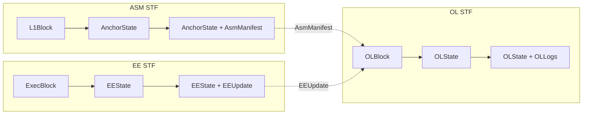

# AGENTS.md

This file provides guidance to AI coding assistants when working with code in this repository.

## Overview

**Alpen** is an EVM-compatible Bitcoin layer 2. It provides programmable Bitcoin functionality through a layer 2 solution with a decoupled architecture separating the Anchor State Machine (ASM), Orchestration Layer (OL), and Execution Environment (EE).

## Architecture

Alpen uses a layered architecture with three main State Transition Functions (STFs):



**State Transition Functions:**

- **ASM STF**: `AnchorState + L1Block → (AnchorState', AsmManifest)`
- **OL STF**: `OLState + OLBlock → (OLState', OLLogs)`
- **EE STF**: `EEState + ExecBlock → (EEState', EEUpdate)`

The OL block contains the `AsmManifest` (from ASM) and `EEUpdate` (from EE), orchestrating the two layers.

### Layer Descriptions

#### L1 Layer (Bitcoin)

Bitcoin serves as the data availability and settlement layer. Protocol transactions are tagged with SPS-50 headers for recognition by the ASM.

- **Bitcoin Blocks**: Source of truth for L1 state and, hence, for everything actually.
- **SPS-50 Tagged Transactions**: All protocol transactions use standardized headers (magic, subprotocol ID, tx_type, aux data)

#### ASM Layer (Anchor State Machine)

ASM is the core of the Strata protocol, functioning as a "virtual smart contract" anchored to L1. It processes L1 blocks and maintains state through subprotocols.

- **ASM STF**: State transition function processing L1 blocks
- **Header Verification**: PoW verification state for L1 headers
- **Subprotocols**: Modular components (Bridge V1, Checkpoint V1, Admin, Debug) with defined IDs
- **Moho Framework**: Upgradeable proof mechanism wrapping ASM transitions
- **Export State**: Accumulator for bridge proofs and operator claims

**Subprotocol IDs:**

| ID | Subprotocol | Purpose |
|----|-------------|---------|
| 0 | Admin | System upgrades |
| 1 | Checkpoint | OL checkpoint verification |
| 2 | Bridge V1 | Deposit/withdrawal management |
| 3 | Execution DA | EE data availability |
| 254 | Debug | Development/testing |

#### OL Layer (Orchestration Layer)

The OL manages L2 state, accounts, and epoch processing. It produces checkpoints that are proven and posted to L1.

- **OL STF**: Processes OL blocks and transactions
- **Account System**: Ledger accounts (with state) and system accounts (precompile-like)
- **Snark Accounts**: Actor-like accounts with inbox MMRs, proven state updates
- **Epochs & Checkpoints**: Time ranges of blocks with DA diffs posted to L1
- **DA Reconstruction**: State can be reconstructed from L1 DA payloads

#### EE Layer (Execution Environment)

The EE provides EVM execution, decoupled from OL. Currently implemented via Alpen Reth.

- **Alpen Reth**: Custom Reth node with rollup-specific precompiles
- **EE Chain**: Execution chain state management
- **OL Tracker**: Tracks finalized OL state from EE perspective
- **Package Chain**: Off-chain interface between OL and EE

## Binary Crates (bin/)

| Binary | Description |
|--------|-------------|
| `strata` | OL (Strata) client |
| `alpen-client` | EE client with OL tracking and payload building |
| `alpen-reth` | Custom Reth node with Alpen precompiles and extensions |
| `prover-client` | Validity proof generation (`checkpoint`, `cl-stf`, `evm-ee` proofs) |
| `strata-sequencer-client` | Lightweight signing client for sequencer duties |
| `alpen-cli` | End-user wallet CLI for deposits, withdrawals, L2 transactions |
| `strata-dbtool` | Database inspection and debugging utility |
| `strata-test-cli` | Bridge and transaction testing utilities |
| `datatool` | Development utility for test data and key generation |
| `prover-perf` | Performance benchmarking for proof systems |

## Library Crates (crates/)

### ASM Domain (`crates/asm/`, `crates/asm-types/`)

Core Anchor State Machine implementation.

| Crate | Description |
|-------|-------------|
| `asm/common` | Core ASM types, state, subprotocol traits, aux data handling |
| `asm/stf` | ASM state transition function and processing stages |
| `asm/subprotocols/bridge-v1` | Bridge subprotocol: deposits, withdrawals, operators |
| `asm/subprotocols/checkpoint-v0` | Checkpoint verification subprotocol |
| `asm/subprotocols/admin` | Administrative operations and upgrades |
| `asm/subprotocols/debug-v1` | Debug subprotocol for testing |
| `asm/txs/bridge-v1` | Bridge transaction parsing (deposit, withdrawal, slash, unstake) |
| `asm/txs/checkpoint` | Checkpoint transaction parsing |
| `asm/txs/admin` | Admin transaction parsing |
| `asm/logs` | ASM log types (deposit, checkpoint, export, forced inclusion) |
| `asm/worker` | ASM worker handle pattern implementation |
| `asm/manifest-types` | L1 block manifest structures (SSZ) |
| `asm/moho-program` | Moho proof program interface |
| `asm/msgs/bridge` | Bridge inter-subprotocol messages |
| `asm/msgs/checkpoint` | Checkpoint inter-subprotocol messages |
| `asm/spec` | Production ASM specification |
| `asm/spec-debug` | Debug ASM specification |
| `asm-types` | Shared ASM type definitions used outside the ASM STF |

### OL Domain (`crates/ol/`, `crates/ol-chain-types/`, `crates/ol-chainstate-types/`)

Orchestration Layer implementation.

| Crate | Description |
|-------|-------------|
| `ol/stf` | OL state transition function (block, epoch, manifest processing) |
| `ol/state-types` | State structures (toplevel, global, epochal, ledger, snark account) |
| `ol/chain-types` | New OL block/transaction/log types (SSZ) |
| `ol/msg-types` | Deposit and withdrawal message types |
| `ol/da` | OL data availability traits |
| `ol/block-assembly` | OL block construction |
| `ol/mempool` | Transaction mempool |
| `ol/state-support-types` | State access layers (batch diff, indexer, write tracking) |
| `ol-chainstate-types` | OL chainstate type definitions |

### EE Domain (`crates/alpen-ee/`, `crates/evm-ee/`, `crates/evmexec/`, `crates/eectl/`, `crates/ee-*`, `crates/simple-ee/`)

Execution Environment implementation.

| Crate | Description |
|-------|-------------|
| `alpen-ee/engine` | EE sync and control logic |
| `alpen-ee/exec-chain` | Execution chain state and orphan tracking |
| `alpen-ee/ol-tracker` | OL state tracking from EE perspective |
| `alpen-ee/sequencer` | EE block building and OL chain tracking |
| `alpen-ee/database` | EE-specific storage (SledDB) |
| `alpen-ee/common` | Shared EE types and traits |
| `alpen-ee/config` | EE configuration |
| `alpen-ee/genesis` | EE genesis state |
| `alpen-ee/block-assembly` | EE block and package assembly |
| `evm-ee` | EVM execution environment integration |
| `evmexec` | EVM execution logic |
| `eectl` | EE controller |
| `ee-acct-types` | EE account types (SSZ) |
| `ee-acct-runtime` | EE account runtime |
| `ee-chain-types` | EE chain types (SSZ) |
| `simple-ee` | Minimal EE implementation for tests and tooling |

### DA Framework (`crates/da-framework/`)

Data Availability primitives for state diff encoding.

| Primitive | Description |
|-----------|-------------|
| `Register` | Simple value replacement |
| `Counter` | Increment-only values |
| `LinearAccumulator` | MMR-style accumulators |
| `Queue` | FIFO structures |
| `Compound` | Nested DA structures |

### Core Types & Utilities

Fundamental types and shared utilities.

| Crate | Description |
|-------|-------------|
| `primitives` | Core primitive types |
| `identifiers` | Block IDs, transaction IDs, account IDs (SSZ) |
| `crypto` | Cryptographic operations |
| `params` | Network parameters |
| `config` | Configuration types |
| `common` | Shared helpers, traits, and utilities |
| `codec-utils` | Helpers for `strata-codec` encoding/decoding |
| `key-derivation` | Key derivation primitives and helpers |
| `mpt` | Merkle-Patricia Trie implementation |
| `status` | Shared status types for services and APIs |
| `cli-common` | Shared CLI argument and output helpers |
| `paas` | Prover-as-a-Service task orchestration framework |

### Bitcoin Types & IO

| Crate | Description |
|-------|-------------|
| `btc-types` | Bitcoin types (blocks, transactions, params) |
| `btc-verification` | Bitcoin header and PoW verification |
| `btcio` | Bitcoin I/O (reader, writer, broadcaster) |

### Storage & State

| Crate | Description |
|-------|-------------|
| `storage` | Storage managers and interfaces |
| `storage-common` | Shared storage abstractions |
| `db/store-sled` | SledDB storage implementation |
| `db/types` | Database type definitions |
| `state` | Chain and client state management |

### Account & Protocol Types

| Crate | Description |
|-------|-------------|
| `acct-types` | Account types and messages (SSZ) |
| `snark-acct-types` | Snark account types (SSZ) |
| `snark-acct-sys` | Snark account system logic |
| `ledger-types` | Ledger entry types |
| `bridge-types` | Bridge operation types |
| `checkpoint-types` | Checkpoint and batch types |
| `checkpoint-types-ssz` | SSZ containers for checkpoint types |
| `csm-types` | Client state machine type definitions |

### Proof Domain (`crates/proof-impl/`, `crates/zkvm/`)

Zero-knowledge proof generation.

| Crate | Description |
|-------|-------------|
| `proof-impl/checkpoint` | Checkpoint proof implementation |
| `proof-impl/cl-stf` | Orchestration layer STF proof |
| `proof-impl/evm-ee-stf` | EE Layer STF proof |
| `zkvm/hosts` | ZKVM host implementations (SP1, RISC0, Native) |

### Reth Integration (`crates/reth/`)

Custom Reth node components.

| Crate | Description |
|-------|-------------|
| `reth/node` | Alpen Reth node implementation |
| `reth/evm` | Custom EVM with Alpen precompiles |
| `reth/exex` | Execution extensions |
| `reth/rpc` | Custom RPC endpoints |
| `reth/chainspec` | Chain specification |
| `reth/statediff` | State diff generation |
| `reth/db` | Reth database glue |
| `reth/primitives` | Reth primitive type bindings |
| `reth/witness` | Witness and tracing helpers |

### RPC (`crates/rpc/`, `crates/rpc-new/`)

RPC APIs, types, and helpers.

| Crate | Description |
|-------|-------------|
| `rpc/utils` | RPC helper utilities |
| `rpc/bridge-api` | Bridge RPC API definitions |
| `rpc/prover-client-api` | Prover client RPC API definitions |
| `rpc-new/api` | New RPC API surface |
| `rpc-new/types` | New RPC type definitions |

### Service Crates

Worker patterns and service infrastructure.

| Crate | Description |
|-------|-------------|
| `chain-worker-new` | Chain worker implementation for new OL types |
| `csm-worker` | Client state machine worker |
| `chainexec` | Chain execution context |
| `chaintsn` | Chain transition logic |
| `consensus-logic` | Fork choice and sync management |
| `sequencer` | Block production and checkpoint handling |
| `sync` | Synchronization logic |

### Test Utilities (`crates/test-utils/`)

| Crate | Description |
|-------|-------------|
| `test-utils` | Shared test helpers |
| `test-utils/btc` | Bitcoin test utilities |
| `test-utils/btcio` | Bitcoin I/O test utilities |
| `test-utils/evm-ee` | EVM EE test utilities |
| `test-utils/l2` | L2 integration test utilities |
| `test-utils/ssz` | SSZ test utilities |
| `db/tests` | Database-focused test fixtures and helpers |

## Development Commands

### Building

```bash
# Build workspace with release profile
just build

# Build specific binary
cargo build --bin strata --release

# Build with specific features
FEATURES="feature1,feature2" just build
```

### Testing

```bash
# Run all unit tests
just test-unit

# Run integration tests
just test-int

# Run functional tests (legacy, requires bitcoind)
just test-functional

# Run new functional tests
cd functional-tests-new && ./run_tests.sh

# Run specific legacy test
cd functional-tests && ./run_test.sh -t bridge/bridge_deposit_happy.py

# Run test group
cd functional-tests && ./run_test.sh -g bridge

# Run prover tests
PROVER_TEST=1 cd functional-tests && ./run_test.sh -g prover
```

### Code Quality

```bash
# Format code
just fmt-ws

# Run linting (use this after changes)
just lint-check-ws

# Or directly with clippy (If Nix is available)
nix develop -c cargo clippy --workspace --lib --bins --examples --tests --benches --all-features --all-targets --locked

# Fix linting issues
just lint-fix-ws

# Run all quality checks (format, lint, spell check)
just lint

# Pre-PR checks (includes tests, docs, linting)
just pr
```

### Docker

```bash
just docker-up    # Start environment
just docker-down  # Stop environment
just docker       # Full restart
```

### Prover Operations

```bash
just prover-eval   # Generate performance reports
just prover-clean  # Clean proof artifacts

# Debug proof generation
ZKVM_MOCK=1 ZKVM_PROFILING=1 cargo run --bin prover-client
```

## Engineering Best Practices

### Rust Guidelines

**"Parse, don't validate"**: Encode data invariants into types using Rust's type system. This reduces runtime errors and makes illegal states unrepresentable.

```rust
// Good: Type encodes invariant
struct SortedVec<T: Ord>(Vec<T>);

impl<T: Ord> SortedVec<T> {
    pub fn new(mut v: Vec<T>) -> Self {
        v.sort();
        Self(v)
    }
}

// Bad: Runtime checks everywhere
fn process(v: &[u32]) {
    assert!(v.is_sorted()); // Must remember to check
}
```

**Avoid heap allocation** in pure library crates. Prefer stack allocation and avoid unnecessary `Arc`ing.

**Avoid absolute paths**. There's even a clippy lint for that that will error in CI `clippy::absolute_paths`.

**Naming conventions**:
- Directories: `kebab-case`
- Files: `snake_case`
- Serde fields: `snake_case`
- Variables: verbose, descriptive names

**Documentation**:
- Use active voice, third-person indicative mood
- Brief first paragraph (single sentence summary)
- Additional paragraphs for details
- Use doclinks: `[`SomeType`]` instead of `` `SomeType` ``

**Import symbols** with `use` statements at the top of the file instead of inline qualified paths.

### Error Handling

| Context | Approach |
|---------|----------|
| Internal sanity checks | `unwrap()` / `expect("reason")` |
| Library errors | `enum Error` / `struct Error` with `thiserror` |
| Application errors | `anyhow` for context propagation |

```rust
// Library error
#[derive(Debug, thiserror::Error)]
pub enum ParseError {
    #[error("invalid header: {0}")]
    InvalidHeader(String),
    #[error("missing field: {field}")]
    MissingField { field: &'static str },
}

// Application error
fn main() -> anyhow::Result<()> {
    let config = load_config()
        .context("failed to load configuration")?;
    Ok(())
}
```

### Logging (Observability)

Use structured logging with `tracing`. Always include relevant context as fields.

**Log Levels**:
| Level | Usage |
|-------|-------|
| `error!` | Unrecoverable errors, requires immediate attention |
| `warn!` | Recoverable issues, potential problems |
| `info!` | Significant events (startup, connections, milestones) |
| `debug!` | Detailed information for debugging |
| `trace!` | Very verbose, step-by-step execution |

**Structured Fields**:
```rust
// Good: Structured fields for querying
info!(%block_id, height, "processing block");

// Bad: String interpolation
info!("processing block {block_id} at height {height}");
```

**Spans**: Any function with significant work must create a span with a `component` field:
```rust
#[tracing::instrument(fields(component = "asm_stf"))]
fn process_block(block: &Block) -> Result<()> {
    // ...
}
```

**Metrics Instruments**:
- `Counter`: Monotonically increasing (requests, errors)
- `UpDownCounter`: Can increase or decrease (active connections)
- `Gauge`: Point-in-time value (temperature, queue size)
- `Histogram`: Distribution of values (latency, sizes)

### Serialization Guidelines

| Context | Format | Crate |
|---------|--------|-------|
| Protocol data structures | SSZ | `ssz_rs`, custom `.ssz` files |
| On-chain envelope payloads | `strata-codec` | `strata-codec` |
| Private proof interfaces | `rkyv` | `rkyv` (zero-copy) |
| Human-readable/config | JSON/TOML | `serde` |

**SSZ** is used for consensus data structures due to:
- Deterministic encoding
- Tree hashing support
- Forward compatibility with `StableContainer`

**`strata-codec`** is a lightweight, compact format for on-chain data where space is critical.

**`rkyv`** provides zero-copy deserialization for proof guest programs where performance matters.

## Git Best Practices

### Commit Message Standards

Follow [Conventional Commits](https://www.conventionalcommits.org/):

```
<type>(<scope>): <subject>

<body>

<footer>
```

**Type Prefixes**:
| Type | Description |
|------|-------------|
| `feat` | New feature (MINOR version) |
| `fix` | Bug fix (PATCH version) |
| `docs` | Documentation only |
| `style` | Formatting, no code change |
| `refactor` | Code restructuring |
| `perf` | Performance improvement |
| `test` | Adding/fixing tests |
| `chore` | Maintenance tasks |

**Breaking Changes**: Use `!` after type/scope.

```
feat(api)!: change response format
```

### Atomic Commits

Each commit should be:
- **Single purpose**: One logical change
- **Self-contained**: Compiles and passes tests
- **Complete**: Doesn't leave work half-done
- **Minimal**: No unrelated changes

### Linear History

Maintain a clean, linear git history:
- Use `git rebase` instead of `git merge`
- Use interactive rebase (`git rebase -i`) to clean up before sharing
- Safe force push: `git push --force-with-lease`

### Workflow

```bash
# Feature development
git checkout -b feat/my-feature
# ... make changes ...
git add -p                          # Stage selectively
git commit -m "feat(scope): description"
git rebase -i main                  # Clean up commits
git push --force-with-lease

# Amending recent commit
git add .
git commit --amend --no-edit

# Recovery
git reflog                          # Find lost commits
git reset --hard HEAD@{n}           # Restore state
```

## Testing Strategy

### Unit Tests

```bash
just test-unit
# Or directly
cargo nextest run
```

Best practices:
- Test public API behavior, not implementation details
- Use descriptive test names: `test_deposit_with_invalid_amount_fails`
- Prefer `assert_eq!` over `assert!` for better error messages

### Integration Tests

```bash
just test-int
```

Cross-component interaction testing in `tests/` directories.

### Functional Tests (New Framework)

Located in `functional-tests-new/`. Uses `uv` for dependency management.

```bash
cd functional-tests-new
./run_tests.sh

# Or with uv
uv run python entry.py
```

**Structure**:
- `common/` - Base test classes, services, utilities
- `envconfigs/` - Environment configurations
- `factories/` - Service factories (Bitcoin, Strata)
- `tests/` - Test files

### Functional Tests (Legacy)

Located in `functional-tests/`. Uses `uv` for dependency management.

```bash
cd functional-tests

# Run specific test
./run_test.sh -t bridge/bridge_deposit_happy.py

# Run test group
./run_test.sh -g bridge

# Start test environment
./run_test.sh -e basic
```

### Prover Tests

```bash
PROVER_TEST=1 cd functional-tests && ./run_test.sh -g prover
```

## Configuration

### Rust Toolchain

- **Toolchain**: Updates monthly to the latest nightly on the first day of the month (see `rust-toolchain.toml`)
- **Components**: cargo, clippy, rustfmt, rust-analyzer, rust-docs, rust-src, rust-std

### Key Dependencies

| Dependency | Purpose |
|------------|---------|
| Reth | Base Ethereum execution client |
| Alloy | Ethereum types and RPC |
| SP1 | Zero-knowledge proof system |
| Bitcoin | Bitcoin protocol implementation |
| SSZ | Serialization |

### Prerequisites

- **bitcoind**: Required for L1 integration and testing
- **uv**: For Python functional tests

## Specifications Reference

Key SPS (Strata Protocol Specification) documents:

| Spec | Name | Description |
|------|------|-------------|
| SPS-50 | L1 Transaction Header | OP_RETURN format for protocol transactions |
| SPS-60 | Moho Proof Mechanism | Upgradeable proof wrapper for ASM |
| SPS-61 | ASM Core Types | ASM state structure and lifecycle |
| SPS-62 | OL Checkpoint Structure | Checkpoint format and verification |
| SPS-63 | OL Checkpointing Subprotocol | Checkpoint processing in ASM |
| SPS-64 | Bridge Subprotocol | Deposit, withdrawal, operator management |
| SPS-ol-stf | Orchestration Layer STF | OL state transition function |
| SPS-acct-sys | Account System | Ledger and system accounts |
| SPS-snark-acct | Snark Accounts | Actor-like accounts with proven updates |
| SPS-ol-chain-structures | Chain Structures | OL block and transaction types |
| SPS-ol-da-primitives | Data Availability Primitives | OL data availability primitives |
| SPS-ol-da-structure | Data Availability Structure | OL data availability structure |

Full specification index available in the team Notion workspace.

## Important Notes

- **Security**: Never commit secrets or keys to the repository
- **Performance**: Proof generation is computationally intensive
- **Dependencies**: Keep Alloy/Revm versions aligned with Reth
- **Just**: Prefer `just` recipes over direct `cargo` commands
- **Linting and Formatting**: Use `just lint-check-ws` and `just fmt-ws` to lint and format code after making changes
