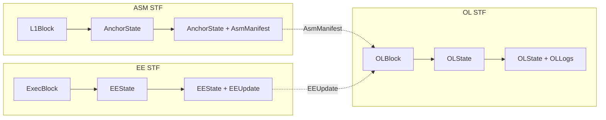

# AGENTS.md

This file provides guidance to AI coding assistants when working with code in this repository.

## Overview

**Alpen** is an EVM-compatible Bitcoin layer 2. It provides programmable Bitcoin functionality through a layer 2 solution with a decoupled architecture separating the Anchor State Machine (ASM), Orchestration Layer (OL), and Execution Environment (EE).

## Architecture

Alpen uses a layered architecture with three main State Transition Functions (STFs):


```mermaid
flowchart LR
    subgraph ASM[ASM STF]
        AnchorState[AnchorState]
        L1Block[L1Block]
        AsmOut[AnchorState + AsmManifest]
    end

    subgraph OL[OL STF]
        OLState[OLState]
        OLBlock[OLBlock]
        OLOut[OLState + OLLogs]
    end

    subgraph EE[EE STF]
        EEState[EEState]
        ExecBlock[ExecBlock]
        EEOut[EEState + EEUpdate]
    end

    L1Block --> AnchorState
    AnchorState --> AsmOut

    OLBlock --> OLState
    OLState --> OLOut

    ExecBlock --> EEState
    EEState --> EEOut

    AsmOut -.->|AsmManifest| OLBlock
    EEOut -.->|EEUpdate| OLBlock
```

**State Transition Functions:**

- **ASM STF**: `AnchorState + L1Block → (AnchorState', AsmManifest)`
- **OL STF**: `OLState + OLBlock → (OLState', OLLogs)`
- **EE STF**: `EEState + ExecBlock → (EEState', EEUpdate)`

The OL block contains the `AsmManifest` (from ASM) and `EEUpdate` (from EE), orchestrating the two layers.

### Layer Descriptions

#### L1 Layer (Bitcoin)

Bitcoin serves as the data availability and settlement layer. Protocol transactions are tagged with SPS-50 headers for recognition by the ASM.

- **Bitcoin Blocks**: Source of truth for L1 state and, hence, for everything actually.
- **SPS-50 Tagged Transactions**: Protocol transactions generally use standardized headers (magic, subprotocol ID, tx_type, aux data). Some EE DA transactions use the SPS-51 chunked-envelope path instead, where a compact commit `OP_RETURN` plus taproot reveal scripts carries the payload to reduce fee overhead.

#### ASM Layer (Anchor State Machine)

ASM is the core of the Strata protocol, functioning as a "virtual smart contract" anchored to L1. It processes L1 blocks and maintains state through subprotocols.

- **ASM STF**: State transition function processing L1 blocks
- **Header Verification**: PoW verification state for L1 headers
- **Subprotocols**: Modular components (Bridge V1, Checkpoint, Admin, Debug) with defined IDs
- **Moho Framework**: Upgradeable proof mechanism wrapping ASM transitions
- **Export State**: Accumulator for bridge proofs and operator claims

The ASM implementation is consumed through the `strata-asm-*` workspace dependencies pinned in the root `Cargo.toml`.

**Subprotocol IDs:**

| ID | Subprotocol | Purpose |
|----|-------------|---------|
| 0 | Admin | System upgrades |
| 1 | Checkpoint | OL checkpoint verification |
| 2 | Bridge V1 | Deposit/withdrawal management |
| 3 | Execution DA | EE data availability |
| 254 | Debug | Development/testing |

#### OL Layer (Orchestration Layer)

The OL manages L2 state, accounts, and epoch processing. It produces checkpoints that are proven and posted to L1.

- **OL STF**: Processes OL blocks and transactions
- **Account System**: Ledger accounts (with state) and system accounts (precompile-like)
- **Snark Accounts**: Actor-like accounts with inbox MMRs, proven state updates
- **Epochs & Checkpoints**: Time ranges of blocks with DA diffs posted to L1
- **DA Reconstruction**: State can be reconstructed from L1 DA payloads

#### EE Layer (Execution Environment)

The EE provides EVM execution, decoupled from OL. Currently implemented via Alpen Reth.

- **Alpen Reth**: Custom Reth node with rollup-specific precompiles
- **EE Chain**: Execution chain state management
- **OL Tracker**: Tracks finalized OL state from EE perspective
- **Package Chain**: Off-chain interface between OL and EE

## Workspace Crates

Crate tables list repository paths. Package names usually carry a `strata-*` or `alpen-*` prefix in `Cargo.toml`.

### Binary Crates (`bin/`)

| Path | Binary target | Description |
|------|---------------|-------------|
| `bin/strata` | `strata` | OL (Strata) client, sequencer, RPC, and prover entrypoint |
| `bin/strata-signer` | `strata-signer` | Detached signer for OL sequencer duties |
| `bin/alpen-client` | `alpen-client` | EE client with OL tracking and payload building, embedding Alpen Reth |
| `bin/alpen-cli` | `alpen` | End-user wallet CLI for deposits, withdrawals, L2 transactions, and bridge tooling |
| `bin/strata-dbtool` | `strata-dbtool` | Database inspection and debugging utility |
| `bin/strata-test-cli` | `strata-test-cli` | Bridge, ASM, and transaction testing utility |
| `bin/datatool` | `strata-datatool` | Development utility for test data and key generation |
| `bin/prover-perf` | `strata-provers-perf` | Performance benchmarking for proof systems |

The workspace default members include the main runtime and testing binaries, but not every workspace crate. Check root `Cargo.toml` before assuming a crate is built by default.

## Library Crates

### ASM Domain

Core ASM code is imported from the `alpenlabs/asm` git dependency family (`strata-asm-*`) pinned in root `Cargo.toml`. Local crates consume ASM manifests, logs, parameters, subprotocol transaction types, and the ASM worker.

### OL Domain (`crates/ol/`)

Orchestration Layer implementation.

| Crate | Description |
|-------|-------------|
| `ol/stf` | OL state transition function (block, epoch, manifest processing) |
| `ol/state-types` | State structures (toplevel, global, epochal, ledger, snark account) |
| `ol/chain-types` | New OL block/transaction/log types (SSZ) |
| `ol/msg-types` | Deposit and withdrawal message types |
| `ol/da` | OL data availability traits |
| `ol/block-assembly` | OL block construction |
| `ol/mempool` | Transaction mempool |
| `ol/state-support-types` | State access layers (batch diff, indexer, write tracking) |
| `ol/state-provider` | OL state provider traits and implementations |
| `ol/genesis` | OL genesis state construction |
| `ol/params` | OL parameter types |
| `ol/checkpoint` | OL checkpoint builder service |
| `ol/sequencer` | OL sequencing helpers and state |
| `ol/rpc/api` | OL JSON-RPC API traits and client/server glue |
| `ol/rpc/types` | OL RPC request and response types |
| `bridge-types` | Bridge operation and message types shared with OL/EE |
| `ledger-types` | Ledger entry and account ledger types |
| `checkpoint-types` | Checkpoint and batch types |

### EE Domain (`crates/alpen-ee/`, `crates/evm-ee/`, `crates/ee-*`, `crates/simple-ee/`)

Execution Environment implementation.

| Crate | Description |
|-------|-------------|
| `alpen-ee/engine` | EE sync and control logic |
| `alpen-ee/exec-chain` | Execution chain state and orphan tracking |
| `alpen-ee/ol-tracker` | OL state tracking from EE perspective |
| `alpen-ee/sequencer` | EE block building and OL chain tracking |
| `alpen-ee/database` | EE-specific storage (SledDB) |
| `alpen-ee/common` | Shared EE types and traits |
| `alpen-ee/config` | EE configuration |
| `alpen-ee/da` | EE data availability payload and inclusion helpers |
| `alpen-ee/genesis` | EE genesis state |
| `alpen-ee/block-assembly` | EE block and package assembly |
| `alpen-ee/rpc/api` | Alpen EE RPC API traits |
| `alpen-ee/rpc/server` | Alpen EE RPC server implementation |
| `alpen-ee/rpc/types` | Alpen EE RPC wire types |
| `evm-ee` | EVM execution environment integration |
| `ee-acct-types` | EE account types (SSZ) |
| `ee-acct-runtime` | EE account runtime |
| `ee-chain-types` | EE chain types (SSZ) |
| `ee-chunk-runtime` | EE chunk proof runtime |
| `simple-ee` | Minimal EE implementation for tests and tooling |

### DA Framework (`crates/da-framework/`)

Data Availability primitives for state diff encoding.

| Primitive | Description |
|-----------|-------------|
| `Register` | Simple value replacement |
| `Counter` | Increment-only values |
| `LinearAccumulator` | MMR-style accumulators |
| `Queue` | FIFO structures |
| `Compound` | Nested DA structures |

### Core Types & Utilities

Fundamental types and shared utilities.

| Crate | Description |
|-------|-------------|
| `primitives` | Core primitive types |
| `params` | Network parameters |
| `config` | Configuration types |
| `common` | Shared helpers, traits, and utilities |
| `codec-utils` | Helpers for `strata-codec` encoding/decoding |
| `key-derivation` | Key derivation primitives and helpers |
| `mpt` | Merkle-Patricia Trie implementation |
| `status` | Shared status types for services and APIs |
| `cli-common` | Shared CLI argument and output helpers |
| `paas` | Prover-as-a-Service task orchestration framework |
| `node-context` | Runtime context shared by node services |
| `strata-signer` | Detached signer library used by `bin/strata-signer` |

### Bitcoin Types & IO

| Crate | Description |
|-------|-------------|
| `btcio` | Bitcoin I/O (reader, writer, broadcaster) |

Bitcoin primitive types, header verification, and related helpers are provided through pinned workspace dependencies from `alpenlabs/strata-common` and `alpenlabs/asm` git dependency family.

### Storage & State

| Crate | Description |
|-------|-------------|
| `storage` | Storage managers and interfaces |
| `storage-common` | Shared storage abstractions |
| `db/store-sled` | SledDB storage implementation |
| `db/types` | Database type definitions |
| `state` | Chain and client state management |

### Account & Protocol Types

| Crate | Description |
|-------|-------------|
| `acct-types` | Account types and messages (SSZ) |
| `snark-acct-types` | Snark account types (SSZ) |
| `snark-acct-runtime` | Snark account runtime |
| `snark-acct-sys` | Snark account system logic |
| `csm-types` | Client state machine type definitions |

### Proof Domain (`crates/proof-impl/`, `crates/zkvm/`)

Zero-knowledge proof generation.

| Crate | Description |
|-------|-------------|
| `proof-impl/checkpoint` | Checkpoint proof implementation |
| `proof-impl/evm-ee-stf` | EE Layer STF proof |
| `proof-impl/alpen-chunk` | Alpen chunk proof implementation |
| `proof-impl/alpen-acct` | Alpen account proof implementation |
| `prover-core` | Shared prover coordination primitives |
| `zkvm/hosts` | ZKVM host implementations (SP1, RISC0, Native) |
| `provers/sp1` | SP1 guest builder support |
| `provers/sp1/guest-checkpoint` | SP1 checkpoint proof guest |
| `provers/sp1/guest-alpen-chunk` | SP1 Alpen chunk proof guest |
| `provers/sp1/guest-alpen-acct` | SP1 Alpen account proof guest |

The SP1 guest packages are local manifests used by the guest builder, but they are not root workspace members.

### Reth Integration (`crates/reth/`)

Custom Reth node components.

| Crate | Description |
|-------|-------------|
| `reth/node` | Alpen Reth node implementation |
| `reth/evm` | Custom EVM with Alpen precompiles |
| `reth/exex` | Execution extensions |
| `reth/rpc` | Custom RPC endpoints |
| `reth/chainspec` | Chain specification |
| `reth/statediff` | State diff generation |
| `reth/db` | Reth database glue |
| `reth/primitives` | Reth primitive type bindings |
| `reth/witness` | Witness and tracing helpers |

### RPC (`crates/rpc/`, `crates/ol/rpc/`)

RPC APIs, types, and helpers.

| Crate | Description |
|-------|-------------|
| `rpc/api` | Shared top-level RPC API definitions |
| `rpc/types` | Shared top-level RPC wire types |
| `rpc/utils` | RPC helper utilities |
| `rpc/open-rpc` | OpenRPC specification model types |
| `rpc/open-rpc-macros` | OpenRPC derive/proc-macro support |

### Service Crates

Worker patterns and service infrastructure.

| Crate | Description |
|-------|-------------|
| `chain-worker` | Legacy chain worker implementation |
| `chain-worker` | Chain worker implementation for OL types |
| `csm-worker` | Client state machine worker |
| `chainexec` | Chain execution context |
| `chaintsn` | Chain transition logic |
| `consensus-logic` | Fork choice and sync management |

### Test Utilities (`crates/test-utils/`)

| Crate | Description |
|-------|-------------|
| `test-utils` | Shared test helpers |
| `test-utils/btcio` | Bitcoin I/O test utilities |
| `test-utils/evm-ee` | EVM EE test utilities |
| `test-utils/l2` | L2 integration test utilities |
| `test-utils/ssz` | SSZ test utilities |
| `db/tests` | Database-focused test fixtures and helpers |
| `benches` | Criterion benchmarks for database paths |

## Development Commands

### Building

```bash
# Build workspace with release profile
just build

# Build specific binary
cargo build --bin strata --release

# Build with specific features
FEATURES="feature1,feature2" just build
```

### Testing

```bash
# Run all unit tests
just test-unit

# Run integration tests
just test-int

# Run functional tests
just test-functional

# Or directly
cd functional-tests && ./run_tests.sh
```

### Code Quality

```bash
# Format code
just fmt-ws

# Run linting (use this after changes)
just lint-check-ws

# Or directly with clippy (If Nix is available)
nix develop -c cargo clippy --workspace --lib --bins --examples --tests --benches --all-features --all-targets --locked

# Fix linting issues
just lint-fix-ws

# Run all quality checks (format, lint, spell check)
just lint

# Pre-PR checks (includes tests, docs, linting)
just pr
```

## Engineering Best Practices

### Rust Guidelines

**"Parse, don't validate"**: Encode data invariants into types using Rust's type system. This reduces runtime errors and makes illegal states unrepresentable.

```rust
// Good: Type encodes invariant
struct SortedVec<T: Ord>(Vec<T>);

impl<T: Ord> SortedVec<T> {
    pub fn new(mut v: Vec<T>) -> Self {
        v.sort();
        Self(v)
    }
}

// Bad: Runtime checks everywhere
fn process(v: &[u32]) {
    assert!(v.is_sorted()); // Must remember to check
}
```

**Avoid heap allocation** in pure library crates. Prefer stack allocation and avoid unnecessary `Arc`ing.

**Avoid absolute paths**. There's even a clippy lint for that that will error in CI `clippy::absolute_paths`.

**Naming conventions**:
- Directories: `kebab-case`
- Files: `snake_case`
- Serde fields: `snake_case`
- Variables: verbose, descriptive names

**Documentation**:
- Use active voice, third-person indicative mood
- Brief first paragraph (single sentence summary)
- Additional paragraphs for details
- Use doclinks: `[`SomeType`]` instead of `` `SomeType` ``

**Import symbols** with `use` statements at the top of the file instead of inline qualified paths.

### Error Handling

| Context | Approach |
|---------|----------|
| Internal sanity checks | `unwrap()` / `expect("reason")` |
| Library errors | `enum Error` / `struct Error` with `thiserror` |
| Application errors | `anyhow` for context propagation |

```rust
// Library error
#[derive(Debug, thiserror::Error)]
pub enum ParseError {
    #[error("invalid header: {0}")]
    InvalidHeader(String),
    #[error("missing field: {field}")]
    MissingField { field: &'static str },
}

// Application error
fn main() -> anyhow::Result<()> {
    let config = load_config()
        .context("failed to load configuration")?;
    Ok(())
}
```

### Logging (Observability)

Use structured logging with `tracing`. Always include relevant context as fields.

**Log Levels**:
| Level | Usage |
|-------|-------|
| `error!` | Unrecoverable errors, requires immediate attention |
| `warn!` | Recoverable issues, potential problems |
| `info!` | Significant events (startup, connections, milestones) |
| `debug!` | Detailed information for debugging |
| `trace!` | Very verbose, step-by-step execution |

**Structured Fields**:
```rust
// Good: Structured fields for querying
info!(%block_id, height, "processing block");

// Bad: String interpolation
info!("processing block {block_id} at height {height}");
```

Prefer shorthand field syntax when the field name already matches the variable:

```rust
// Good: shorthand keeps tracing calls compact
info!(?batch_id, %foo, "processing batch");

// Avoid: repeated field names add noise
info!(batch_id = ?batch_id, foo = %foo, "processing batch");
```

Avoid adding ad hoc `component` fields to logs when the module path or surrounding spans already provide enough context.

**Spans**: Any function with significant work should create a span when it improves correlation. Prefer the span name and module path for context, and only add a `component` field when it adds signal beyond the existing metadata:
```rust
#[tracing::instrument(fields(component = "asm_stf"))]
fn process_block(block: &Block) -> Result<()> {
    // ...
}
```

**Metrics Instruments**:
- `Counter`: Monotonically increasing (requests, errors)
- `UpDownCounter`: Can increase or decrease (active connections)
- `Gauge`: Point-in-time value (temperature, queue size)
- `Histogram`: Distribution of values (latency, sizes)

### Serialization Guidelines

| Context | Format | Crate |
|---------|--------|-------|
| Protocol data structures | SSZ | `ssz_rs`, custom `.ssz` files |
| On-chain envelope payloads | `strata-codec` | `strata-codec` |
| Private proof interfaces | `rkyv` | `rkyv` (zero-copy) |
| Human-readable/config | JSON/TOML | `serde` |

**SSZ** is used for consensus data structures due to:
- Deterministic encoding
- Tree hashing support
- Forward compatibility with `StableContainer`

**`strata-codec`** is a lightweight, compact format for on-chain data where space is critical.

**`rkyv`** provides zero-copy deserialization for proof guest programs where performance matters.

## Git Best Practices

### Commit Message Standards

Follow [Conventional Commits](https://www.conventionalcommits.org/):

```
<type>(<scope>): <subject>

<body>

<footer>
```

**Type Prefixes**:
| Type | Description |
|------|-------------|
| `feat` | New feature (MINOR version) |
| `fix` | Bug fix (PATCH version) |
| `docs` | Documentation only |
| `style` | Formatting, no code change |
| `refactor` | Code restructuring |
| `perf` | Performance improvement |
| `test` | Adding/fixing tests |
| `chore` | Maintenance tasks |

**Breaking Changes**: Use `!` after type/scope.

```
feat(api)!: change response format
```

### Atomic Commits

Each commit should be:
- **Single purpose**: One logical change
- **Self-contained**: Compiles and passes tests
- **Complete**: Doesn't leave work half-done
- **Minimal**: No unrelated changes

### Linear History

Maintain a clean, linear git history:
- Use `git rebase` instead of `git merge`
- Use interactive rebase (`git rebase -i`) to clean up before sharing
- Safe force push: `git push --force-with-lease`

### Workflow

```bash
# Feature development
git checkout -b feat/my-feature
# ... make changes ...
git add -p                          # Stage selectively
git commit -m "feat(scope): description"
git rebase -i main                  # Clean up commits
git push --force-with-lease

# Amending recent commit
git add .
git commit --amend --no-edit

# Recovery
git reflog                          # Find lost commits
git reset --hard HEAD@{n}           # Restore state
```

## Testing Strategy

### Unit Tests

```bash
just test-unit
# Or directly
cargo nextest run
```

Best practices:
- Test public API behavior, not implementation details
- Use descriptive test names: `test_deposit_with_invalid_amount_fails`
- Prefer `assert_eq!` over `assert!` for better error messages

### Functional Tests

Located in `functional-tests/`. Uses `uv` for dependency management.

```bash
cd functional-tests
./run_tests.sh

# Or with uv
uv run python entry.py
```

**Structure**:
- `common/` - Base test classes, services, utilities
- `envconfigs/` - Environment configurations
- `factories/` - Service factories (Bitcoin, Strata)
- `tests/` - Test files

If the functional tests fail, you can find the logs in the `_dd` directory inside the functional tests directory.
The datadir will be the outputted by the test framework and will be named after the test run.

## Configuration

### Key Dependencies

| Dependency | Purpose |
|------------|---------|
| Reth | Base Ethereum execution client |
| Alloy | Ethereum types and RPC |
| SP1 | Zero-knowledge proof system |
| Bitcoin | Bitcoin protocol implementation |
| SSZ | Serialization |

### Prerequisites

- **bitcoind**: Required for L1 integration and testing
- **uv**: For Python functional tests

## Specifications Reference

Key SPS (Strata Protocol Specification) documents:

| Spec | Name | Description |
|------|------|-------------|
| SPS-50 | L1 Transaction Header | OP_RETURN format for protocol transactions |
| SPS-51 | Generic Envelope format | Bitcoin envelope format for protocol transactions |
| SPS-60 | Moho Proof Mechanism | Upgradeable proof wrapper for ASM |
| SPS-61 | ASM Core Types | ASM state structure and lifecycle |
| SPS-62 | OL Checkpoint Structure | Checkpoint format and verification |
| SPS-63 | OL Checkpointing Subprotocol | Checkpoint processing in ASM |
| SPS-64 | Bridge Subprotocol | Deposit, withdrawal, operator management |
| SPS-ol-stf | Orchestration Layer STF | OL state transition function |
| SPS-acct-sys | Account System | Ledger and system accounts |
| SPS-snark-acct | Snark Accounts | Actor-like accounts with proven updates |
| SPS-ol-chain-structures | Chain Structures | OL block and transaction types |
| SPS-ol-da-primitives | Data Availability Primitives | OL data availability primitives |
| SPS-ol-da-structure | Data Availability Structure | OL data availability structure |

Full specification index available in the team Notion workspace.
If you have the Notion MCP/connector enabled, access it by searching the team workspace for the SPS number or the "Strata Protocol Specification" index.

## Important Notes

- **Security**: Never commit secrets or keys to the repository
- **Performance**: Proof generation is computationally intensive
- **Dependencies**: Keep Alloy/Revm versions aligned with Reth
- **Just**: Prefer `just` recipes over direct `cargo` commands
- **Linting and Formatting**: Use `just lint-check-ws` and `just fmt-ws` to lint and format code after making changes
