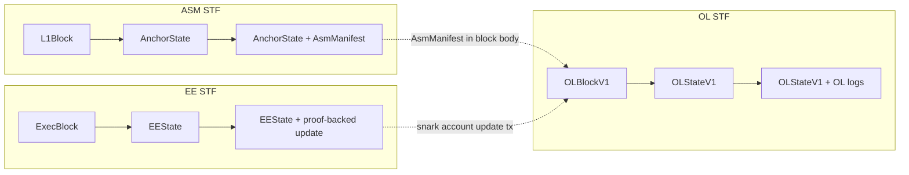

# AGENTS.md

This file provides guidance to AI coding assistants when working with code in this repository.

## Overview

**Alpen** is an EVM-compatible Bitcoin layer 2. It provides programmable Bitcoin functionality through a layer 2 solution with a decoupled architecture separating the Anchor State Machine (ASM), Orchestration Layer (OL), and Execution Environment (EE).

This repository contains the OL node, its supporting crates, and the OL checkpoint
prover. The ASM implementation lives in
[alpenlabs/asm](https://github.com/alpenlabs/asm), and shared protocol primitives live
in [alpenlabs/strata-common](https://github.com/alpenlabs/strata-common); both are
consumed as tagged git dependencies. The EE lives in the downstream
[alpenlabs/alpen-ee](https://github.com/alpenlabs/alpen-ee) repository, which consumes
selected crates and binaries from this repository at a pinned revision.

## Architecture

Alpen uses a layered architecture with three main State Transition Functions (STFs):


```mermaid
flowchart LR
    subgraph ASM[ASM STF]
        AnchorState[AnchorState]
        L1Block[L1Block]
        AsmOut[AnchorState + AsmManifest]
    end

    subgraph OL[OL STF]
        OLState[OLStateV1]
        OLBlock[OLBlockV1]
        OLOut[OLStateV1 + OL logs]
    end

    subgraph EE[EE STF]
        EEState[EEState]
        ExecBlock[ExecBlock]
        EEOut[EEState + proof-backed update]
    end

    L1Block --> AnchorState
    AnchorState --> AsmOut

    OLBlock --> OLState
    OLState --> OLOut

    ExecBlock --> EEState
    EEState --> EEOut

    AsmOut -.->|AsmManifest in block body| OLBlock
    EEOut -.->|snark account update tx| OLBlock
```

**State Transition Functions:**

- **ASM STF**: `AnchorState + L1Block → (AnchorState', AsmManifest)`
- **OL STF**: `OLStateV1 + OLBlockV1 + OLRuntimeParams → (OLStateV1', OL logs)`
- **EE STF**: `EEState + ExecBlock → (EEState', proof-backed account update)`

`OLBlockBodyV1` contains an optional transaction segment and an optional sequence of
`AsmManifest`s produced by the ASM STF. EE state updates are not a dedicated block
field: the EE submits proof-backed snark account update transactions, which the OL STF
verifies against the account's predicate. The EE names in the diagram are conceptual;
their concrete implementation and types live in `alpen-ee`.

### Layer Descriptions

#### L1 Layer (Bitcoin)

Bitcoin serves as the data availability and settlement layer. Protocol transactions are tagged with SPS-50 headers for recognition by the ASM.

- **Bitcoin Blocks**: Source of truth for L1 state and, hence, for everything actually.
- **SPS-50 Tagged Transactions**: Protocol transactions generally use standardized headers (magic, subprotocol ID, tx_type, aux data).
- **SPS-51 Chunked Envelopes**: EE DA payloads use a compact commit `OP_RETURN` plus taproot reveal scripts. The EE produces the payload; the `btcio` writer and storage interfaces in this repository publish and track the envelope transactions.

#### ASM Layer (Anchor State Machine)

ASM is the core of the Strata protocol, functioning as a "virtual smart contract" anchored to L1. It processes L1 blocks and maintains state through subprotocols.

- **ASM STF**: State transition function processing L1 blocks
- **Header Verification**: PoW verification state for L1 headers
- **Subprotocols**: Modular components (Admin, Checkpoint, Bridge V1) with defined IDs
- **Moho Framework**: Upgradeable proof mechanism wrapping ASM transitions
- **Export State**: Accumulator for bridge proofs and operator claims

The ASM implementation is consumed through the `strata-asm-*` workspace dependencies pinned in the root `Cargo.toml`.

**Subprotocol IDs:**

| ID | Subprotocol | Purpose |
|----|-------------|---------|
| 0 | Admin | System upgrades |
| 1 | Checkpoint | OL checkpoint verification |
| 2 | Bridge V1 | Deposit/withdrawal management |

The pinned `StrataAsmSpec` invokes exactly these three subprotocols. The former Debug
subprotocol was removed; functional tests create deposits through the bridge path.

#### OL Layer (Orchestration Layer)

The OL manages L2 state, accounts, and epoch processing. It produces checkpoints that are proven and posted to L1.

- **OL STF**: Processes OL blocks and transactions
- **Account System**: Ledger accounts (with state) and system accounts (precompile-like)
- **Snark Accounts**: Actor-like accounts with inbox MMRs, proven state updates
- **Epochs & Checkpoints**: Time ranges of blocks with DA diffs posted to L1
- **DA Reconstruction**: State can be reconstructed from L1 DA payloads

Concrete consensus types live in `-v1` crates and carry `V1` type suffixes, such as
`OLBlockV1`, `OLTransactionV1`, and `OLStateV1`. Unsuffixed crates such as
`ol/state-types` and `ol/da-common` hold version-independent traits and helpers.

#### EE Layer (Execution Environment)

The EE provides EVM execution, decoupled from OL. `alpen-ee` owns Alpen Reth, the EE
chain and DA producer, EE proof programs, precompiles, and the OL tracker. This
repository has no local EE or Reth implementation and no direct Reth or Revm
dependency. Alloy remains in the dependency graph through external protocol crates.

From the OL's perspective, the EE is a snark account whose state, inbox, and predicate
are maintained in `OLSnarkAccountStateV1`. This repository owns the shared account and
message types, OL RPC interfaces, L1 DA publishing plumbing, genesis inputs, and mock
EE helpers that cross the repository boundary.

The EE consumes this repo's crates as git dependencies, and builds the `strata`,
`strata-signer`, `strata-datatool` and `strata-test-cli` binaries from a pinned
rev of it for its functional tests. Changes to those binaries' CLI surfaces are
breaking changes for that repo.

## Workspace Crates

Crate tables list repository paths. Package names usually carry a `strata-*` or `alpen-*` prefix in `Cargo.toml`.

### Binary Crates (`bin/`)

| Path | Binary target | Description |
|------|---------------|-------------|
| `bin/strata` | `strata` | OL (Strata) client, sequencer, RPC, and prover entrypoint |
| `bin/strata-signer` | `strata-signer` | Detached signer for OL sequencer duties (package `strata-signer-bin`) |
| `bin/strata-dbtool` | `strata-dbtool` | Database inspection and debugging utility |
| `bin/strata-test-cli` | `strata-test-cli` | Bridge, ASM, and transaction testing utility |
| `bin/datatool` | `strata-datatool` | Development utility for test data and key generation |
| `bin/prover-perf` | `strata-provers-perf` | Performance benchmarking for proof systems |

The workspace default-member paths are `bin/strata`, `bin/strata-dbtool`,
`bin/strata-signer`, `bin/datatool`, and `bin/strata-test-cli`. Check the root
`Cargo.toml` before assuming that another crate or target is built by default.

## Library Crates

### ASM Domain

Core ASM code is imported from the `alpenlabs/asm` git dependency family (`strata-asm-*`) pinned in root `Cargo.toml`. Local crates consume ASM manifests, logs, parameters, subprotocol transaction types, and the ASM worker.

### OL Domain (`crates/ol/`)

Orchestration Layer implementation.

| Crate | Description |
|-------|-------------|
| `ol/stf-v1` | OL state transition function (block, epoch, manifest processing) |
| `ol/state-types` | Version-independent state traits and ledger entry types |
| `ol/state-types-v1` | Concrete state structures (toplevel, global, epochal, ledger, snark account) |
| `ol/chain-types-v1` | Versioned OL block types (SSZ); re-exports OL log types from `strata-common` |
| `ol/tx-types-v1` | Versioned OL transaction, GAM/SAU payload, and transaction-proof types (SSZ) |
| `ol/msg-types` | Deposit and withdrawal message types |
| `ol/da-common` | Version-independent OL data availability traits and encoding helpers |
| `ol/da-types-v1` | Concrete V1 OL DA payload types, scheme, and checkpoint-tx extractor |
| `ol/block-assembly` | OL block construction |
| `ol/mempool` | Transaction mempool |
| `ol/state-support-types` | State access layers (batch diff, indexer, write tracking) |
| `ol/state-provider` | OL state provider traits and implementations |
| `ol/mmr-index` | OL-owned MMR index comparison and reconciliation helpers |
| `ol/genesis` | OL genesis state construction |
| `ol/params` | `OLGenesisParams`, `OLRuntimeParams`, and combined `OLParams` |
| `ol/checkpoint` | OL checkpoint builder service |
| `ol/sequencer` | OL sequencing helpers and state |
| `ol/rpc/api` | OL JSON-RPC API traits and client/server glue |
| `ol/rpc/types` | OL RPC request and response types |

### DA Framework (`crates/da-framework/`)

Data Availability primitives for state diff encoding.

| Primitive | Description |
|-----------|-------------|
| `Register` | Simple value replacement |
| `Counter` | Increment-only values |
| `LinearAccumulator` | MMR-style accumulators |
| `Queue` | FIFO structures |
| `Compound` | Nested DA structures |

### Core Types & Utilities

Fundamental types and shared utilities.

| Crate | Description |
|-------|-------------|
| `primitives` | Core primitive types |
| `config` | Configuration types |
| `common` | Shared helpers, traits, and utilities |
| `codec-utils` | Helpers for `strata-codec` encoding/decoding |
| `key-derivation` | Key derivation primitives and helpers |
| `status` | Shared status types for services and APIs |
| `cli-common` | Shared CLI argument and output helpers |
| `node-context` | Runtime context shared by node services |
| `strata-signer` | Detached signer library used by `bin/strata-signer` |

### Bitcoin Types & IO

| Crate | Description |
|-------|-------------|
| `btcio` | Bitcoin I/O (reader, writer, broadcaster) |

Bitcoin primitive types, header verification, and related helpers are provided through pinned workspace dependencies from `alpenlabs/strata-common` and `alpenlabs/asm` git dependency family.

### Storage & State

| Crate | Description |
|-------|-------------|
| `storage` | Storage managers and interfaces |
| `storage-common` | Shared storage abstractions |
| `db/store-sled` | SledDB storage implementation |
| `db/types` | Database type definitions |

### Account & Protocol Types

| Crate | Description |
|-------|-------------|
| `acct-types` | Account types and messages (SSZ) |
| `snark-acct-types` | Snark account types (SSZ) |
| `snark-acct-runtime` | Snark account runtime |
| `snark-acct-sys` | Snark account system logic |
| `csm-types` | Client state machine type definitions |
| `bridge-types` | Bridge operation and message types shared with OL/EE |
| `bridge-params` | Bridge denomination and withdrawal-cap parameters |
| `checkpoint-types` | Checkpoint, batch, terminal-header, and prover-task types |

### Proof Domain (`crates/proof-impl/`, `crates/zkvm/`)

Zero-knowledge proof generation.

| Crate | Description |
|-------|-------------|
| `proof-impl/checkpoint` | Checkpoint proof implementation |
| `proof-impl/predicate-keys` | Predicate-key providers for proof programs |
| `prover-core` | Single-proof-type proving engine with zkaleido native or remote strategies |
| `paas` | Prover-as-a-Service wrapper around `prover-core` |
| `zkvm/hosts` | SP1 host integration, enabled by the `sp1` feature |
| `provers/sp1` | Root-workspace SP1 checkpoint guest builder |
| `provers/sp1/guest-checkpoint` | SP1 checkpoint proof guest |

`provers/sp1/guest-checkpoint` declares an independent workspace and is not a root
workspace member. For a real non-debug guest build, the builder embeds
`OLRuntimeParams` supplied through `CHECKPOINT_RUNTIME_PARAMS_PATH`; the resulting
checkpoint verification key therefore commits to the runtime parameters. Without a
real guest build, the builder uses test runtime parameters and mock artifacts.
The `strata` binary runs the checkpoint prover in-process behind its `prover` and `sp1`
features; the former standalone prover client has been removed.

### RPC (`crates/rpc/`)

OpenRPC support. OL JSON-RPC traits and wire types live under `crates/ol/rpc/` and are
listed with the OL crates above.

| Crate | Description |
|-------|-------------|
| `rpc/open-rpc` | OpenRPC specification model types |
| `rpc/open-rpc-macros` | OpenRPC derive/proc-macro support |
| `rpc/open-rpc-spec` | OL OpenRPC document assembly |

### Service Crates

Worker patterns and service infrastructure.

| Crate | Description |
|-------|-------------|
| `chain-worker` | Executes and persists OL blocks using the OL STF |
| `csm-worker` | Follows ASM worker state and processes checkpoint-subprotocol logs |
| `consensus-logic` | OL fork choice, sync, checkpoint sync, unfinalized tracking, and MMR reconciliation |

### Test Utilities (`crates/test-utils/`)

| Crate | Description |
|-------|-------------|
| `test-utils/test-utils` | Shared test helpers |
| `test-utils/btcio` | Bitcoin I/O test utilities |
| `test-utils/l2` | OL component test utilities |
| `test-utils/ssz` | SSZ test utilities |
| `db/tests` | Database-focused test fixtures and helpers |
| `benches` | Criterion benchmarks for database paths |

## Development Commands

### Building

```bash
# Build all workspace libraries, binaries, examples, and benches with all features
just build

# Build the node and tools with the features used by functional tests
cargo build --locked -F sequencer -F debug-utils -F prover \
  --bin strata --bin strata-signer --bin strata-datatool \
  --bin strata-test-cli --bin strata-dbtool
```

### Testing

```bash
# Run all unit tests
just test-unit

# Run unit tests and doctests
just test

# Run functional tests
just test-functional

# Or directly
cd functional-tests && ./run_tests.sh
```

### Code Quality

```bash
# Format code
just fmt-ws

# Run linting (use this after changes)
just lint-check-ws

# Or directly with clippy (If Nix is available)
nix develop -c cargo clippy --workspace --lib --bins --examples --tests --benches --all-features --all-targets --locked

# Fix linting issues
just lint-fix-ws

# Run all quality checks (format, lint, spell check)
just lint

# Pre-PR checks (includes functional tests)
just pr

# Pre-PR checks without functional tests
just pr-lite
```

`just lint` includes the ticketed-comment check: new `TODO` and `FIXME` comments must
include a ticket such as `TODO(STR-1234): ...`.

## Engineering Best Practices

### Rust Guidelines

**"Parse, don't validate"**: Encode data invariants into types using Rust's type system. This reduces runtime errors and makes illegal states unrepresentable.

```rust
// Good: Type encodes invariant
struct SortedVec<T: Ord>(Vec<T>);

impl<T: Ord> SortedVec<T> {
    pub fn new(mut v: Vec<T>) -> Self {
        v.sort();
        Self(v)
    }
}

// Bad: Runtime checks everywhere
fn process(v: &[u32]) {
    assert!(v.is_sorted()); // Must remember to check
}
```

**Avoid heap allocation** in pure library crates. Prefer stack allocation and avoid unnecessary `Arc`ing.

Borrow values for inspection, consume them when ownership is required, and use `&mut`
for in-place updates. Avoid unconditional clones, temporary collections, repeated encoding
buffers, and `Arc` without an actual sharing requirement.

**Avoid absolute paths**. There's even a clippy lint for that that will error in CI `clippy::absolute_paths`.

**Naming conventions**:
- Directories: `kebab-case`
- Files: `snake_case`
- Serde fields: `snake_case`
- Variables: verbose, descriptive names
- Functions: precise verbs for work; bare noun accessors for cheap field access
- Conversions: `as_` for cheap borrowed views, `to_` for allocating conversions, and
  `with_` for builder-style methods

**Documentation**:
- Use active voice, third-person indicative mood
- Brief first paragraph (single sentence summary)
- Additional paragraphs for details
- Use doclinks: `[`SomeType`]` instead of `` `SomeType` ``
- Document non-obvious invariants, ordering requirements, preconditions, and design
  rationale. Explain why the code exists instead of restating what it does.

**Import symbols** with `use` statements at the top of the file instead of inline qualified paths.

Implement `Default` only when the type has a meaningful domain default; use fixtures or
generators for arbitrary test values. Add `const` only when compile-time use is meaningful
and intended as an API guarantee.

### Design and API Boundaries

- Give each component a focused responsibility. Keep protocol and pure processing logic
  independent of RPC, persistence, orchestration, and runtime policy.
- Express dependencies through narrow capability or context traits. Prefer existing state
  accessor traits over concrete state implementations, and keep concrete databases and
  services in the integration layer.
- Keep binaries focused on loading configuration, opening resources, setting up
  observability, and launching reusable library services. Put substantive RPC,
  synchronization, processing, and service implementations in library crates.
- Do not expose `pub` fields on nontrivial domain structs. Keep fields and implementation
  details private, then expose constructors, accessors, borrowed views, and domain
  operations that preserve invariants and hide storage or serialization wrappers. Public
  fields are appropriate only for deliberately transparent data carriers with no invariants.
- Reuse authoritative protocol algorithms, validation, assembly, codecs, and test helpers.
  Factor repeated behavior at the layer that owns it instead of reimplementing it at call
  sites.
- Keep constructors to field assembly and basic sanity checks. Use explicitly named
  initialization functions for substantial work or I/O.
- Use typed identifiers and domain values internally, converting them to strings only at
  presentation boundaries. Avoid accepting independent arguments that can form an
  incoherent state.
- Separate user configuration from network and protocol parameters. Derive settings from
  their authoritative source instead of duplicating constants or asking users to configure
  inferable values. Low-level crates own their configuration types and must not depend on
  the top-level node configuration.
- Declare dependency versions in the workspace root and inherit them with
  `workspace = true`.

### Error Handling

| Context | Approach |
|---------|----------|
| Invalid input or recoverable failure | Return `Result` with structured variants |
| Expected absence | Return `Option`; do not invent a sentinel or default value |
| Violated internal invariant or programming bug | `assert!`, `unwrap()`, or `expect("specific invariant")` |
| Library errors | `enum Error` / `struct Error` with `thiserror` |
| Application boundary errors | `anyhow` for context propagation |

Panics identify bugs or violated internal assumptions, never normal user or runtime errors.
Document panicking conditions in a `# Panics` section on public APIs. Preserve useful error
distinctions at abstraction boundaries; do not collapse unrelated failures into opaque
strings or catch-all variants. Error messages should describe the failure without adding a
redundant `error` prefix.

```rust
// Library error
#[derive(Debug, thiserror::Error)]
pub enum ParseError {
    #[error("invalid header: {0}")]
    InvalidHeader(String),
    #[error("missing field: {field}")]
    MissingField { field: &'static str },
}

// Application error
fn main() -> anyhow::Result<()> {
    let config = load_config()
        .context("failed to load configuration")?;
    Ok(())
}
```

### Async and Concurrency

- Never perform blocking I/O or other blocking work on an async executor thread. Use the
  async API or isolate the work with the runtime's blocking-task facility.
- Do not hold a lock guard across an `.await` point.
- Keep worker state owned by the worker. Expose commands and status through a handle rather
  than sharing the worker's mutable internals behind locks.

### Logging (Observability)

Use structured logging with `tracing`. Always include relevant context as fields.

**Log Levels**:
| Level | Usage |
|-------|-------|
| `error!` | Unrecoverable errors, requires immediate attention |
| `warn!` | Unexpected, actionable conditions where processing can continue |
| `info!` | Significant events (startup, connections, milestones) |
| `debug!` | Detailed information for debugging |
| `trace!` | Very verbose, step-by-step execution |

**Structured Fields**:
```rust
// Good: Structured fields for querying
info!(%block_id, height, "processing block");

// Bad: String interpolation
info!("processing block {block_id} at height {height}");
```

Prefer shorthand field syntax when the field name already matches the variable:

```rust
// Good: shorthand keeps tracing calls compact
info!(?batch_id, %foo, "processing batch");

// Avoid: repeated field names add noise
info!(batch_id = ?batch_id, foo = %foo, "processing batch");
```

Avoid adding ad hoc `component` fields to logs when the module path or surrounding spans already provide enough context.

Expected lag, graceful shutdown, irrelevant traffic, and rejected untrusted input should
not produce repetitive warnings. Keep pure processing free of operational logging when the
caller can report the outcome with better context.

**Spans**: Any function with significant work should create a span when it improves correlation. Prefer the span name and module path for context, and only add a `component` field when it adds signal beyond the existing metadata:
```rust
#[tracing::instrument(fields(component = "asm_stf"))]
fn process_block(block: &Block) -> Result<()> {
    // ...
}
```

**Metrics Instruments**:
- `Counter`: Monotonically increasing (requests, errors)
- `UpDownCounter`: Can increase or decrease (active connections)
- `Gauge`: Point-in-time value (temperature, queue size)
- `Histogram`: Distribution of values (latency, sizes)

### Serialization Guidelines

| Context | Format | Crate |
|---------|--------|-------|
| Protocol data structures | SSZ | `ssz`, `ssz_derive`, and `tree_hash` from `alpenlabs/ssz-gen`; custom `.ssz` schemas |
| On-chain envelope payloads | `strata-codec` | `strata-codec` |
| Private proof interfaces and sled values | `rkyv` | `rkyv` (zero-copy) |
| Non-protocol persistent data | CBOR | `ciborium` |
| Human-readable/config | JSON/TOML | `serde` |

**SSZ** is used for consensus data structures due to:
- Deterministic encoding
- Tree hashing support
- Forward compatibility with `StableContainer`

**`strata-codec`** is a lightweight, compact format for on-chain data where space is critical.

**`rkyv`** provides zero-copy deserialization for proof guest programs where performance matters.

Use distinct domain or runtime types and wire or storage types when those roles have
different fields or invariants. Use the boundary's designated compact codec for nested
message or log bodies when the boundary already provides framing. Borsh has been removed
from the workspace; do not reintroduce it.

## Git Best Practices

### Pull Requests

Before opening a pull request, read and follow
[`.github/PULL_REQUEST_TEMPLATE.md`](.github/PULL_REQUEST_TEMPLATE.md). Use the
Conventional Commit format below for the PR title, and use the template's complete
structure for the PR body, including its self-review, testing, documentation, and AI-use
disclosure checklist. Keep PRs focused and independently reviewable; split unrelated
restructuring or migrations into separate PRs.

### Commit Message Standards

Follow [Conventional Commits](https://www.conventionalcommits.org/):

```
<type>(<scope>): <subject>

<body>

<footer>
```

**Type Prefixes**:
| Type | Description |
|------|-------------|
| `feat` | New feature (MINOR version) |
| `fix` | Bug fix (PATCH version) |
| `docs` | Documentation only |
| `style` | Formatting, no code change |
| `refactor` | Code restructuring |
| `perf` | Performance improvement |
| `test` | Adding/fixing tests |
| `chore` | Maintenance tasks |

**Breaking Changes**: Use `!` after type/scope.

```
feat(api)!: change response format
```

### Atomic Commits

Each commit should be:
- **Single purpose**: One logical change
- **Self-contained**: Compiles and passes tests
- **Complete**: Doesn't leave work half-done
- **Minimal**: No unrelated changes

### Linear History

Maintain a clean, linear git history:
- Use `git rebase` instead of `git merge`
- Use interactive rebase (`git rebase -i`) to clean up before sharing
- Safe force push: `git push --force-with-lease`

### Workflow

```bash
# Feature development
git checkout -b feat/my-feature
# ... make changes ...
git add -p                          # Stage selectively
git commit -m "feat(scope): description"
git rebase -i main                  # Clean up commits
git push --force-with-lease

# Amending recent commit
git add .
git commit --amend --no-edit

# Recovery
git reflog                          # Find lost commits
git reset --hard HEAD@{n}           # Restore state
```

## Testing Strategy

### Unit Tests

```bash
just test-unit
# Or directly
cargo nextest run
```

Best practices:
- Test public API behavior, not implementation details
- Use descriptive test names: `test_deposit_with_invalid_amount_fails`
- Prefer `assert_eq!` over `assert!` for better error messages
- Keep unit tests independent of external processes; use functional tests for running-node
  behavior
- Exercise production assembly or encoding paths together with verification or decoding
- Reuse common fixtures, environment-readiness checks, and high-level wait helpers
- Test repository behavior rather than re-testing guarantees of upstream libraries

### Functional Tests

Located in `functional-tests/`. Uses `uv` for dependency management.

```bash
cd functional-tests
./run_tests.sh

# Or with uv
uv run python entry.py
```

**Structure**:
- `common/` - Base test classes, services, utilities
- `envconfigs/` - Environment configurations
- `factories/` - Service factories (Bitcoin, Strata, signer)
- `tests/` - Test files
- `fixtures/` - Static test fixtures

Tests are grouped under `tests/` by component (`btcio`, `checkpoint`, `dbtool`,
`ol_isolated`, and `strata`). Use `./run_tests.sh -g <group>` to select groups or
`./run_tests.sh -t <test>` to select tests. The script builds `strata`,
`strata-signer`, `strata-datatool`, `strata-test-cli`, and `strata-dbtool` with the
`sequencer`, `debug-utils`, and `prover` features.

If the functional tests fail, you can find the logs in the `_dd` directory inside the functional tests directory.
The datadir will be the outputted by the test framework and will be named after the test run.

## Configuration

### Key Dependencies

| Dependency | Purpose |
|------------|---------|
| SP1 | Zero-knowledge proof system |
| zkaleido | zkVM host and guest abstractions |
| `alpenlabs/asm` | ASM STF, subprotocols, parameters, and worker |
| `alpenlabs/strata-common` | Shared identifiers, codecs, crypto, Merkle primitives, logs, and service utilities |
| Bitcoin | Bitcoin protocol implementation |
| `alpenlabs/ssz-gen` | SSZ serialization and schema code generation |

### Parameters and Node Configuration

Configuration is split by ownership:

- **ASM parameters** (`AsmParams`, `asm-params.json`, `--asm-params`) define the L1
  anchor, network, magic bytes, and subprotocol genesis configuration.
- **OL parameters** (`OLParams`, `ol-params.json`, `--ol-params`) contain
  `OLGenesisParams` and `OLRuntimeParams`. Runtime parameters are threaded through OL
  execution and embedded in real checkpoint guest builds, so changing them changes the
  checkpoint verification key.
- **Node configuration** (TOML types under `crates/config`) contains operational settings,
  including `BtcioConfig` and its L1 reader, writer, fee, and reorg policy.

Generate ASM and OL parameter files with `strata-datatool gen-asm-params` and
`strata-datatool gen-ol-params`. At startup, `strata` rejects ASM and OL parameter files
whose bridge denomination, genesis L1 commitment/height, or genesis OL block ID disagree.
Do not duplicate protocol parameters in node config.

### Prerequisites

- **bitcoind**: Required for L1 integration and testing
- **uv**: For Python functional tests
- **just** and **cargo-nextest**: Required by the common development recipes
- **SP1 toolchain**: Required only when building real checkpoint guest artifacts

## Specifications Reference

Key SPS (Strata Protocol Specification) documents:

| Spec | Name | Description |
|------|------|-------------|
| SPS-50 | L1 Transaction Header | OP_RETURN format for protocol transactions |
| SPS-51 | Generic Envelope format | Bitcoin envelope format for protocol transactions |
| SPS-60 | Moho Proof Mechanism | Upgradeable proof wrapper for ASM |
| SPS-61 | ASM Core Types | ASM state structure and lifecycle |
| SPS-62 | OL Checkpoint Structure | Checkpoint format and verification |
| SPS-63 | OL Checkpointing Subprotocol | Checkpoint processing in ASM |
| SPS-64 | Bridge Subprotocol | Deposit, withdrawal, operator management |
| SPS-ol-stf | Orchestration Layer STF | OL state transition function |
| SPS-acct-sys | Account System | Ledger and system accounts |
| SPS-snark-acct | Snark Accounts | Actor-like accounts with proven updates |
| SPS-ol-chain-structures | Chain Structures | OL block and transaction types |
| SPS-ol-da-primitives | Data Availability Primitives | OL data availability primitives |
| SPS-ol-da-structure | Data Availability Structure | OL data availability structure |

Full specification index available in the team Notion workspace.
If you have the Notion MCP/connector enabled, access it by searching the team workspace for the SPS number or the "Strata Protocol Specification" index.

## Important Notes

- **Security**: Never commit secrets or keys to the repository
- **Performance**: Proof generation is computationally intensive
- **Just**: Prefer `just` recipes over direct `cargo` commands
- **Linting and Formatting**: Use `just lint-check-ws` and `just fmt-ws` to lint and format code after making changes
