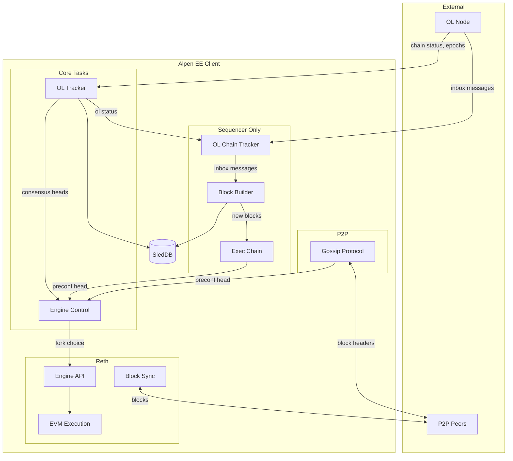
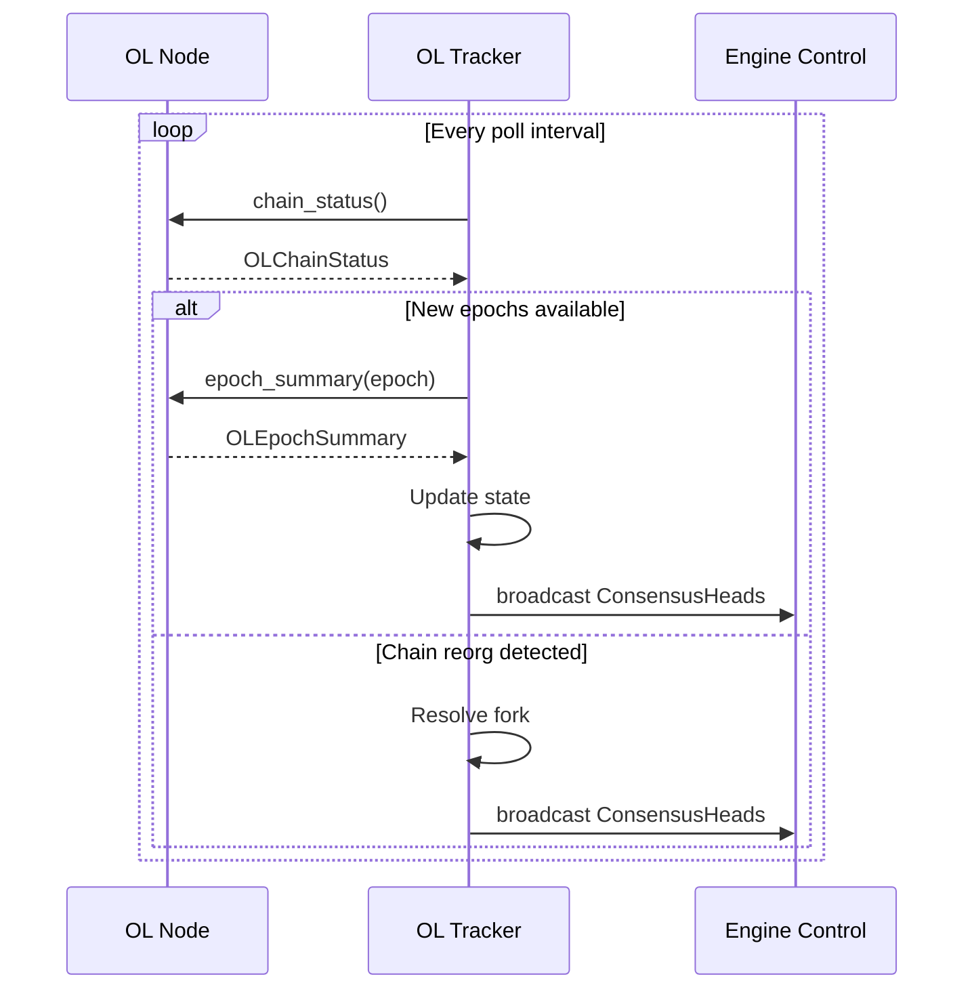
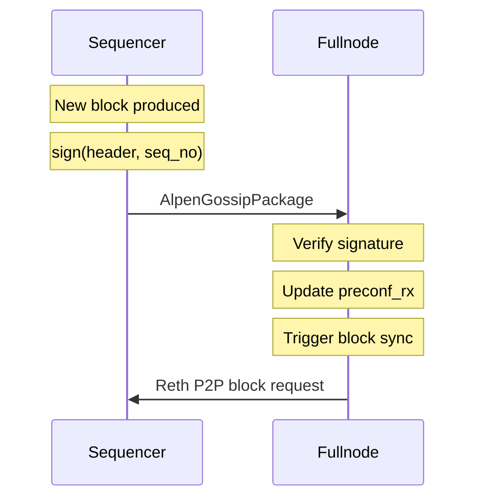
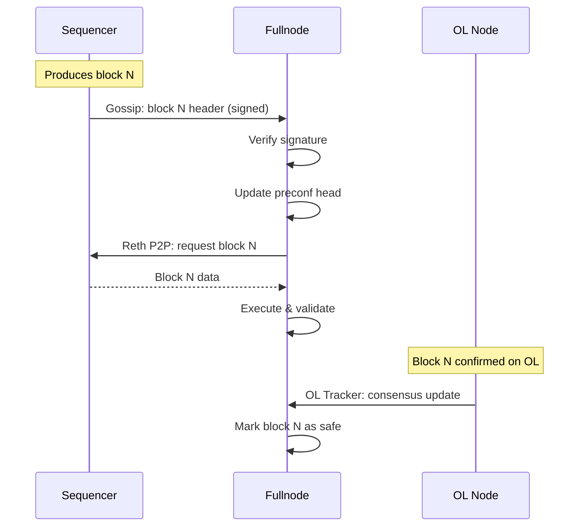
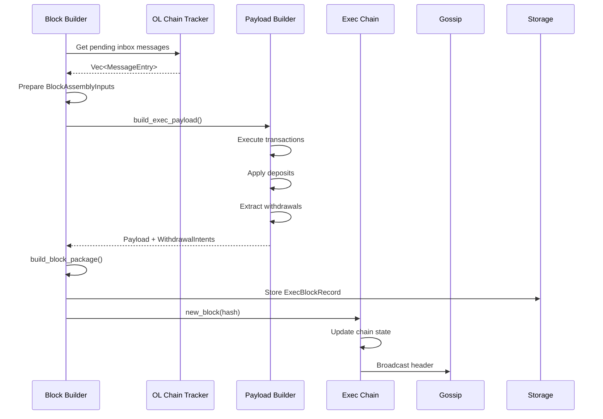

# Alpen EE Client

This document provides a high-level overview of the Alpen Execution Environment (EE) client, a Reth-based node that serves as either a sequencer or fullnode for an EVM-based execution layer on Strata Orchestration Layer (OL).

## Table of Contents

- [Overview](#overview)
- [System Context](#system-context)
- [Node Architecture](#node-architecture)
- [Component Deep Dives](#component-deep-dives)
  - [OL Tracker](#ol-tracker)
  - [Engine Control](#engine-control)
  - [Exec Chain (Sequencer)](#exec-chain-sequencer)
  - [Block Builder (Sequencer)](#block-builder-sequencer)
  - [Gossip Protocol](#gossip-protocol)
- [Data Flows](#data-flows)
  - [Block Sync (Fullnode)](#block-sync-fullnode)
  - [Block Production (Sequencer)](#block-production-sequencer)
  - [Deposit Processing](#deposit-processing)
  - [Withdrawal Processing](#withdrawal-processing)
- [Key Abstractions](#key-abstractions)
- [Persistence](#persistence)
- [Glossary](#glossary)

---

## Overview

The Alpen EE client wraps [Reth](https://github.com/paradigmxyz/reth) (a Rust Ethereum execution client) and extends it to operate as part of a larger system anchored to Bitcoin via the Strata OL.

The client operates in two modes:

| Mode | Purpose |
|------|---------|
| **Sequencer** | Produces new EE blocks, processes deposits, broadcasts blocks to peers, posts updates with SNARK proofs to OL |
| **Fullnode** | Follows the OL and sequencer, validates blocks, serves RPC queries |

Key characteristics:
- EVM-compatible execution environment
- Consensus derived from OL (which itself derives finality from Bitcoin)
- Deposits flow from L1 (Bitcoin) through OL into the EE
- Withdrawals flow from EE through OL back to L1

---

## System Context

The EE exists within a layered architecture anchored to Bitcoin:

```
┌─────────────────────────────────────────────────────────────────────┐
│                         Bitcoin (L1)                                │
│   - Source of truth for finality                                    │
│   - Data Availability (DA) for OL state                             │
│   - Deposit/withdrawal settlement                                   │
└───────────────────────────────┬─────────────────────────────────────┘
                                │
                    ┌───────────▼───────────┐
                    │  Orchestration Layer  │
                    │        (OL)           │
                    │                       │
                    │  - Thin Bitcoin L2    │
                    │  - Accepts EE updates │
                    │  - Validates SNARKs   │
                    │  - Routes messages    │
                    └───────────┬───────────┘
                                │
              ┌─────────────────┼─────────────────┐
              │                 │                 │
              ▼                 ▼                 ▼
        ┌──────────┐      ┌──────────┐      ┌──────────┐
        │   EE 1   │      │   EE 2   │      │   EE N   │
        │  (This)  │      │          │      │          │
        └──────────┘      └──────────┘      └──────────┘
```

Each EE corresponds to an "account" on OL. Updates from an EE to OL must include SNARK proofs validated against the account's verification key (VK) stored in OL state.

### Trust Model

The EE and OL each have their own chains and client binaries:

| Layer | Chain | Client Binary |
|-------|-------|---------------|
| **OL** | OL blocks grouped into epochs | OL client (not covered here) |
| **EE** | EVM blocks | `alpen-client` (this binary) |

An entity running an EE node must also run a paired OL node.

```
┌──────────────────┐    trusts    ┌──────────────────┐    derives from    ┌─────────┐
│    EE Client     │ ──────────►  │    OL Client     │  ───────────────►  │ Bitcoin │
│  (alpen-client)  │              │                  │                    └─────────┘
└──────────────────┘              └──────────────────┘
         │                                 │
         └─────── run by same entity ──────┘
```

The EE client trusts its paired OL client for:
- Chain status (latest, confirmed, finalized blocks)
- Inbox messages (deposits from L1, etc)
- Finality determinations

---

## Node Architecture

### High-Level Component Diagram




### Communication Pattern: Watch Channels

Components communicate via `tokio::sync::watch` channels for efficient state broadcasting:

```
OL Tracker ──┬── consensus_rx ──► Engine Control
             │
             └── ol_status_rx ──► OL Chain Tracker (sequencer)

Exec Chain ───── preconf_rx ────► Engine Control

Gossip ───────── preconf_rx ────► Engine Control
```

---

## Component Deep Dives

### OL Tracker

**Purpose**: Polls the OL chain and maintains the EE's view of consensus state.

**Location**: [crates/alpen-ee/ol_tracker/src/](../../../crates/alpen-ee/ol_tracker/src/)

**Responsibilities**:
- Poll OL node for chain status at regular intervals
- Track confirmed and finalized EE account state per epoch
- Detect and handle chain reorganizations
- Broadcast consensus updates to downstream components

**Key State**:
```
OLTrackerState
├── confirmed: EeAccountStateAtEpoch  // State at confirmed epoch
└── finalized: EeAccountStateAtEpoch  // State at finalized epoch
```

**Outputs** (via watch channels):
- `ConsensusHeads` - confirmed and finalized EE block hashes
- `OLFinalizedStatus` - finalized OL block and corresponding EE block



---

### Engine Control

**Purpose**: Bridges OL consensus state to Reth's Engine API, managing fork choice updates.

**Location**: [crates/alpen-ee/engine/src/control.rs](../../../crates/alpen-ee/engine/src/control.rs)

**Responsibilities**:
- Listen for consensus updates from OL Tracker
- Listen for pre-confirmed blocks from sequencer/gossip
- Translate consensus state to EVM `ForkchoiceState`
- Issue `fork_choice_updated` calls to Reth

**Inputs** (via watch channels):
- `consensus_rx` - from OL Tracker (confirmed/finalized heads)
- `preconf_rx` - from Exec Chain or Gossip (latest head)

**Fork Choice Mapping**:
```
OL Consensus          →    EVM ForkchoiceState
─────────────────────────────────────────────
preconf head          →    head_block_hash
confirmed block       →    safe_block_hash
finalized block       →    finalized_block_hash
```

---

### Exec Chain (Sequencer)

**Purpose**: Maintains an in-memory view of the canonical execution chain, tracking both finalized and unfinalized blocks.

**Location**: [crates/alpen-ee/exec-chain/src/](../../../crates/alpen-ee/exec-chain/src/)

**Block Lifecycle**: When the sequencer produces a new block, it is initially stored as **unfinalized**. The Exec Chain tracks these unfinalized blocks and determines which chain is canonical. Blocks only become **finalized** when confirmed by the OL (via OL Tracker updates). This means the sequencer's "latest" blocks are always unfinalized until OL confirmation.

**Responsibilities**:
- Track unfinalized block chains extending from the finalized tip
- Determine canonical chain tip among unfinalized blocks
- Manage orphan blocks waiting for parents
- Broadcast pre-confirmed head updates

**Key State**:
```
ExecChainState
├── finalized_block: Hash
├── unfinalized: UnfinalizedTracker  // Tree of chains
├── orphans: OrphanTracker           // Blocks awaiting parents
└── blocks: HashMap<Hash, ExecBlockRecord>
```

**Interaction Pattern**:
```
Block Builder ──► ExecChainHandle::new_block(hash)
                         │
                         ▼
              ┌─────────────────────┐
              │ exec_chain_task     │
              │  - Attach to chain  │
              │  - Resolve orphans  │
              │  - Update tip       │
              └──────────┬──────────┘
                         │
                         ▼
              preconf_tx.send(new_tip)
                         │
                         ▼
                  Engine Control
```

---

### Block Builder (Sequencer)

**Purpose**: Assembles new EE blocks by combining pending transactions with OL inbox messages.

**Location**: [crates/alpen-ee/sequencer/src/block_builder/](../../../crates/alpen-ee/sequencer/src/block_builder/)

**Responsibilities**:
- Enforce block time constraints
- Fetch and process inbox messages (deposits) from OL
- Build execution payloads via Reth's payload builder
- Extract withdrawal intents from execution results
- Create and store `ExecBlockRecord`

**Block Assembly Flow**:
```
┌─────────────────────────────────────────────────────────────┐
│                    Block Builder Task                       │
├─────────────────────────────────────────────────────────────┤
│  1. Check blocktime constraint                              │
│  2. Fetch inbox messages from OL Chain Tracker              │
│  3. Build inputs (deposits, limited per block)              │
│                         │                                   │
│                         ▼                                   │
│  4. ┌─────────────────────────────────────┐                 │
│     │     Payload Builder Engine          │                 │
│     │  - Execute transactions             │                 │
│     │  - Apply deposit mints              │                 │
│     │  - Extract withdrawal intents       │                 │
│     └─────────────────────────────────────┘                 │
│                         │                                   │
│                         ▼                                   │
│  5. Build ExecBlockPackage (inputs + outputs)               │
│  6. Create ExecBlockRecord                                  │
│  7. Store in database                                       │
│  8. Notify Exec Chain                                       │
└─────────────────────────────────────────────────────────────┘
```

**Configuration** ([BlockBuilderConfig](../../../crates/alpen-ee/sequencer/src/block_builder/task.rs)):
- `blocktime_ms` - Target block interval (default: 1000ms)
- `max_deposits_per_block` - Deposit throughput limit (default: 16)

---

### Gossip Protocol

**Purpose**: Custom RLPx subprotocol for propagating block headers from sequencer to fullnodes.

**Location**: [crates/reth/node/src/gossip/](../../../crates/reth/node/src/gossip/)

**Responsibilities**:
- Broadcast new block headers from sequencer
- Receive and validate block headers from peers
- Verify sequencer signatures (Schnorr over EIP-191 hash)
- Forward validated headers to engine control

**Protocol Details**:
- Protocol name: `alpen_gossip` (version 1)
- Message signing: Schnorr signatures with sequencer key
- Verification: All nodes verify against known sequencer pubkey

**Message Structure**:
```
AlpenGossipPackage
├── message: AlpenGossipMessage
│   ├── header: Block Header
│   └── seq_no: Sequence Number
├── public_key: Buf32 (sequencer pubkey)
└── signature: Buf64 (Schnorr signature)
```

**Flow**:


---

## Data Flows

### Block Sync (Fullnode)

Fullnodes learn about new blocks through two mechanisms:

1. **Consensus (Confirmed/Finalized)**: From OL via OL Tracker
2. **Pre-confirmed (Latest)**: From sequencer via Gossip Protocol



**Important**: EE fullnodes do not have independent block sync. They rely on:
- Reth's P2P for block data (triggered by gossip)
- OL for consensus (confirmed/finalized status)

---

### Block Production (Sequencer)



---

### Deposit Processing

Deposits flow from Bitcoin L1 through OL into the EE:

```
┌─────────┐    ┌─────────┐    ┌─────────┐    ┌─────────┐
│   L1    │    │   OL    │    │   EE    │    │   EVM   │
│(Bitcoin)│    │         │    │ Client  │    │  State  │
└────┬────┘    └────┬────┘    └────┬────┘    └────┬────┘
     │              │              │              │
     │ deposit tx   │              │              │
     ├─────────────►│              │              │
     │              │              │              │
     │   finalized  │              │              │
     │◄─────────────┤              │              │
     │              │              │              │
     │              │ inbox msg    │              │
     │              ├─────────────►│              │
     │              │              │              │
     │              │              │ mint to addr │
     │              │              ├─────────────►│
     │              │              │              │
```

**Key Points**:
- Only messages from finalized OL blocks are processed (to avoid reorg issues)
- Deposits are rate-limited per block (`max_deposits_per_block`)
- Subject ID (32 bytes) is truncated to EVM address (20 bytes)
- Bitcoin amounts (sats) are converted to wei

---

### Withdrawal Processing

Withdrawals flow from EE through OL back to Bitcoin:

```
┌─────────┐    ┌─────────────┐    ┌─────────┐    ┌─────────┐
│   EVM   │    │   Payload   │    │   OL    │    │   L1    │
│  State  │    │   Builder   │    │         │    │(Bitcoin)│
└────┬────┘    └──────┬──────┘    └────┬────┘    └────┬────┘
     │                │                │              │
     │ withdrawal     │                │              │
     │ intent         │                │              │
     ├───────────────►│                │              │
     │                │                │              │
     │                │ BlockOutputs   │              │
     │                │ (SentMessage)  │              │
     │                ├───────────────►│              │
     │                │                │              │
     │                │                │    bridge    │
     │                │                ├─────────────►│
     │                │                │              │
```

**Status**: Withdrawal extraction is implemented. Batch submission to OL with SNARK proofs is not yet implemented.

---

## Key Abstractions

### Core Traits

| Trait | Location | Purpose |
|-------|----------|---------|
| `OLClient` | [common/src/traits/ol_client.rs](../../../crates/alpen-ee/common/src/traits/ol_client.rs) | Read OL chain state |
| `SequencerOLClient` | [common/src/traits/ol_client.rs](../../../crates/alpen-ee/common/src/traits/ol_client.rs) | Extended OL access for sequencer |
| `Storage` | [common/src/traits/storage.rs](../../../crates/alpen-ee/common/src/traits/storage.rs) | EE account state persistence |
| `ExecBlockStorage` | [common/src/traits/storage.rs](../../../crates/alpen-ee/common/src/traits/storage.rs) | Execution block persistence |
| `ExecutionEngine` | [common/src/traits/engine/](../../../crates/alpen-ee/common/src/traits/engine/) | Abstract EVM interaction |
| `PayloadBuilderEngine` | [common/src/traits/engine/](../../../crates/alpen-ee/common/src/traits/engine/) | Block payload construction |

### Core Types

| Type | Location | Purpose |
|------|----------|---------|
| `ConsensusHeads` | [common/src/types/](../../../crates/alpen-ee/common/src/types/) | Confirmed + finalized block hashes |
| `EeAccountState` | [common/src/types/](../../../crates/alpen-ee/common/src/types/) | EE account state on OL |
| `EeAccountStateAtEpoch` | [common/src/types/](../../../crates/alpen-ee/common/src/types/) | Account state at specific epoch |
| `ExecBlockRecord` | [common/src/types/](../../../crates/alpen-ee/common/src/types/) | Full block with metadata |
| `ExecBlockPackage` | [common/src/types/](../../../crates/alpen-ee/common/src/types/) | Block inputs + outputs |
| `OLChainStatus` | [common/src/types/](../../../crates/alpen-ee/common/src/types/) | OL chain tip information |

---

## Persistence

Storage traits are defined in [common/src/traits/storage/](../../../crates/alpen-ee/common/src/traits/storage/). These define the semantics and constraints for persistent state - implementations may vary.

### EE Account State (`Storage` trait)

Tracks the EE's account state on OL across epochs.

**What is stored**:
- `EeAccountStateAtEpoch` - The EE account state snapshot at each OL epoch

**Constraints**:
- States are stored per epoch and indexed by both epoch number and terminal block ID
- Writes must be sequential - cannot skip epochs
- Supports rollback to a prior epoch (removes all states above the target epoch)
- Null epochs are rejected

**Used by**: OL Tracker (to persist and recover account state across restarts)

### Execution Blocks (`ExecBlockStorage` trait)

Tracks EE blocks with a distinction between finalized and unfinalized blocks.

**What is stored**:
- `ExecBlockRecord` - Block metadata, package (inputs/outputs), and account state
- `ExecBlockPayload` - Serialized block payload (for re-execution)

**Constraints**:

1. **Canonical finalized chain**: Only a single linear chain of finalized blocks exists
   - Initialized with a genesis block
   - Extended one block at a time (parent must match current tip)
   - Can be reverted to a prior height (blocks become unfinalized, data preserved)

2. **Unfinalized blocks**: All blocks above the finalized tip must be accessible
   - May include forks (multiple blocks at the same height)
   - Can be deleted individually (finalized blocks cannot be deleted)

3. **Pruning**: Block data below a certain height can be permanently removed
   - Both block records and payloads are deleted
   - Finalization status is unaffected

**Used by**:
- Block Builder (stores new blocks)
- Exec Chain (loads unfinalized blocks on startup)

```
                    ┌─────────────────────────────────────────┐
                    │           Block Storage                 │
                    ├─────────────────────────────────────────┤
   pruned           │  finalized chain    │  unfinalized      │
   (deleted)        │  (single canonical) │  (may have forks) │
                    │                     │                   │
◄──────────────────►│◄───────────────────►│◄─────────────────►│
   height < N       │   genesis ... tip   │   tip+1 ...       │
                    │                     │                   │
                    └─────────────────────────────────────────┘
```

---

## Glossary

| Term | Definition |
|------|------------|
| **EE** | Execution Environment - the EVM-based execution layer (this system) |
| **OL** | Orchestration Layer - thin Bitcoin L2 that coordinates EEs |
| **Epoch** | A batch of OL blocks; the terminal block contains L1-specific data |
| **ExecBlock** | An EE block with associated metadata (inputs, outputs) |
| **Package** | Synonym for ExecBlock; contains block commitment + I/O data |
| **Confirmed** | Block included in OL but not yet finalized on L1 |
| **Finalized** | Block buried to sufficient depth on L1 (determined by OL) |
| **Preconf** | Pre-confirmed; latest sequencer block not yet on OL |
| **Inbox** | Messages from OL to EE (currently: deposits from L1) |
| **Outbox** | Messages from EE to OL (currently: withdrawals to L1) |
| **DA** | Data Availability - OL state is posted to L1 for data availability |
| **SNARK** | Succinct proof accompanying EE updates to OL |
| **VK** | Verification Key - stored on OL per EE account for proof validation |

---

## What's Not Yet Implemented

- **Batch Assembly**: Grouping multiple EE blocks into batches for OL submission
- **SNARK Proof Generation**: Proving EE state transitions
- **OL Update Submission**: Posting proofs and state updates to OL
- **Cross-EE Messaging**: Messages between different EEs via OL
- **Independent Block Sync**: EE fullnodes currently rely on sequencer P2P
