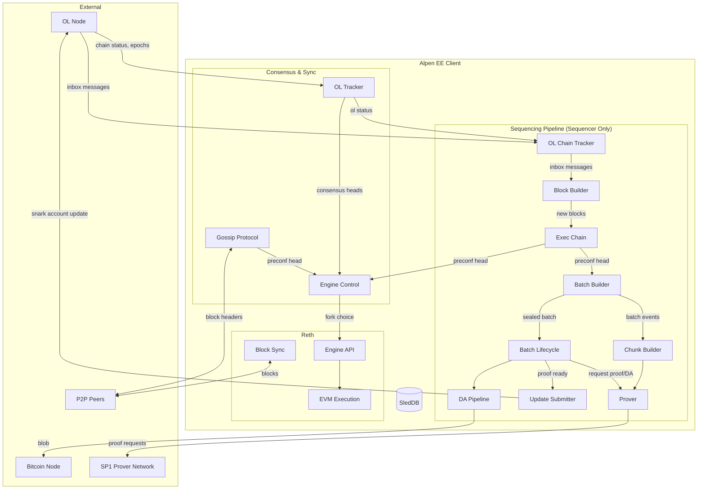
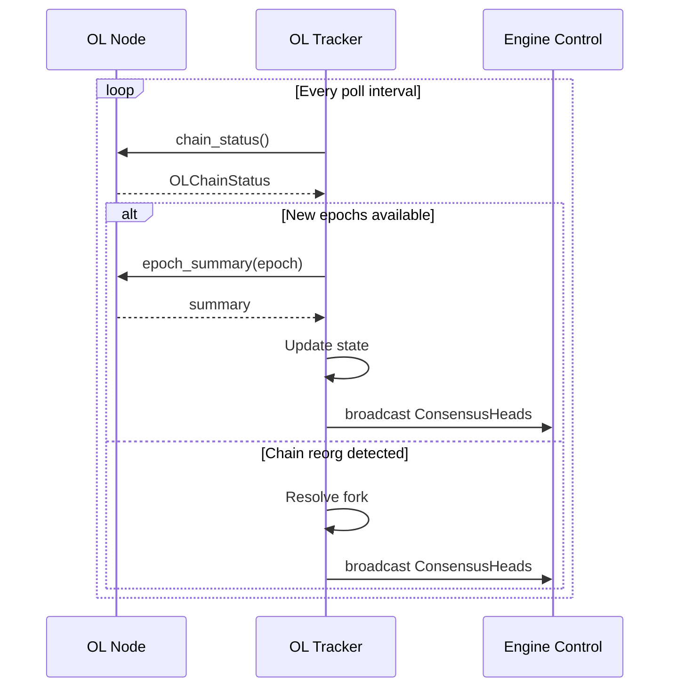
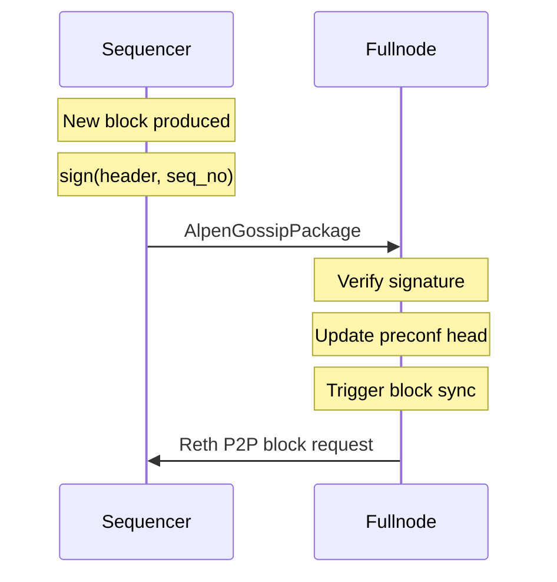
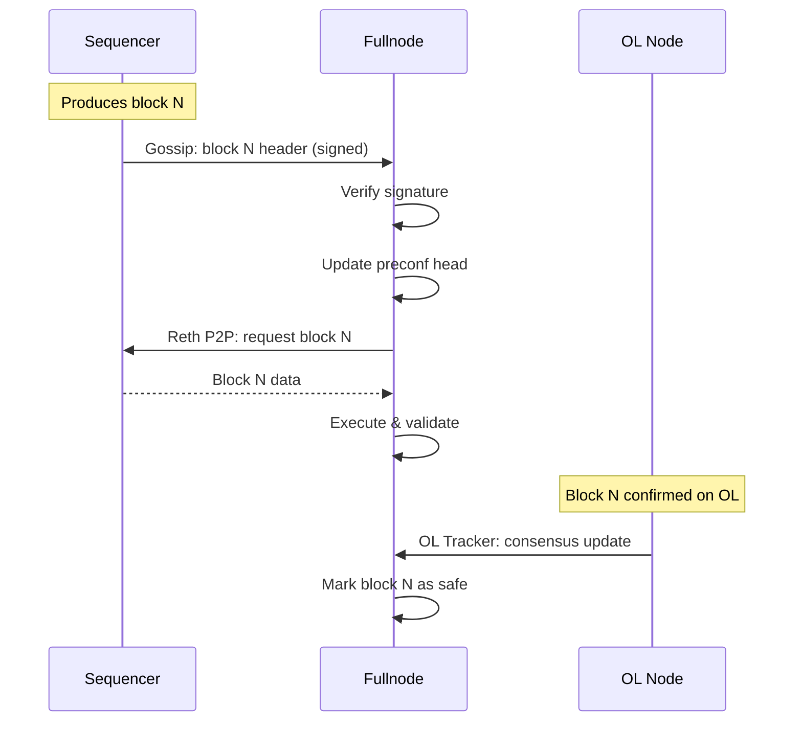
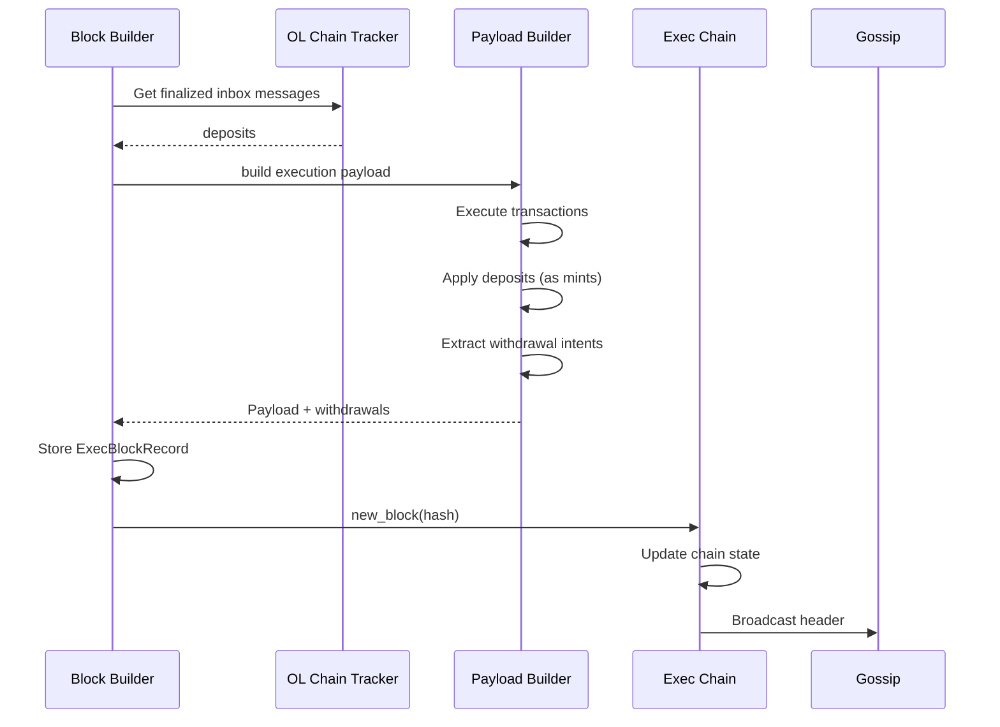
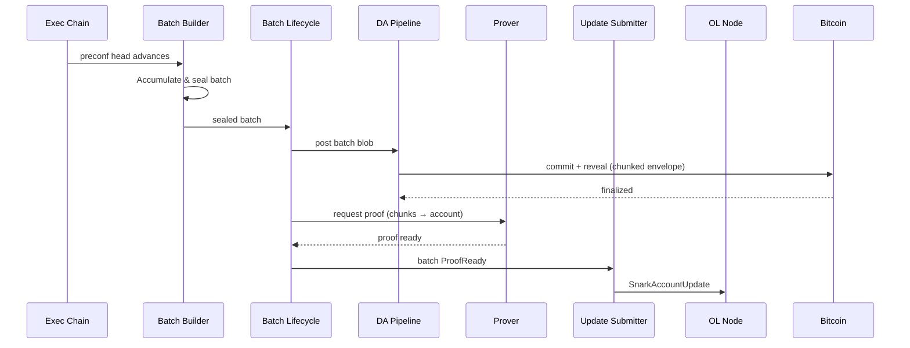
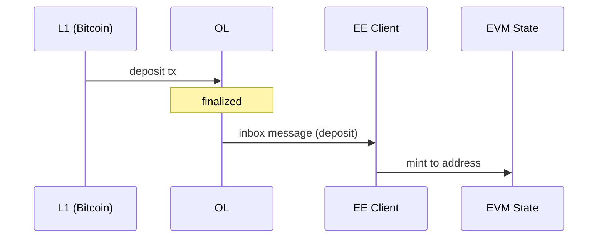
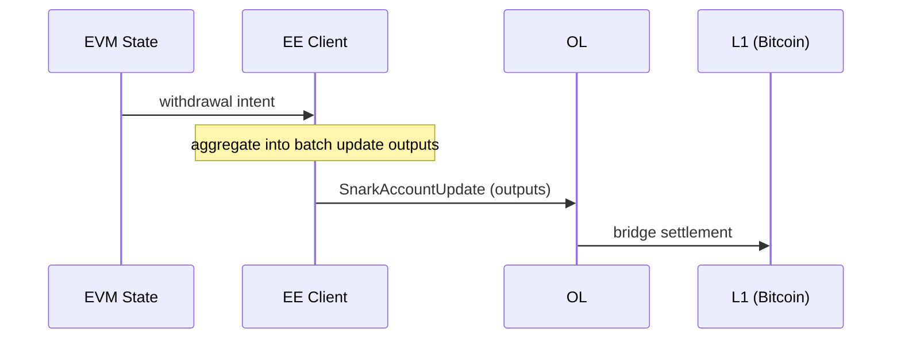

# Alpen EE Client

This document provides a high-level overview of the Alpen Execution Environment (EE) client, a Reth-based node that serves as either a sequencer or fullnode for an EVM-based execution layer on the Strata Orchestration Layer (OL).

It describes the structure of the node, the flow of blocks from production through settlement on Bitcoin, and the key concepts involved. It intentionally stays high-level; consult the linked source for implementation detail.

## Table of Contents

- [Overview](#overview)
- [System Context](#system-context)
- [Key Concepts](#key-concepts)
- [Node Architecture](#node-architecture)
- [Components](#components)
  - [OL Tracker](#ol-tracker)
  - [OL Chain Tracker (Sequencer)](#ol-chain-tracker-sequencer)
  - [Engine Control](#engine-control)
  - [Block Builder (Sequencer)](#block-builder-sequencer)
  - [Exec Chain (Sequencer)](#exec-chain-sequencer)
  - [Batch Builder (Sequencer)](#batch-builder-sequencer)
  - [Chunk Builder (Sequencer)](#chunk-builder-sequencer)
  - [Batch Lifecycle (Sequencer)](#batch-lifecycle-sequencer)
  - [Prover (Sequencer)](#prover-sequencer)
  - [DA Pipeline (Sequencer)](#da-pipeline-sequencer)
  - [Update Submitter (Sequencer)](#update-submitter-sequencer)
  - [Gossip Protocol](#gossip-protocol)
- [Data Flows](#data-flows)
  - [Block Sync (Fullnode)](#block-sync-fullnode)
  - [Block Production (Sequencer)](#block-production-sequencer)
  - [Batch Settlement (Sequencer)](#batch-settlement-sequencer)
  - [Deposit Processing](#deposit-processing)
  - [Withdrawal Processing](#withdrawal-processing)
- [Key Abstractions](#key-abstractions)
- [Persistence](#persistence)
- [Configuration](#configuration)
- [RPC & Observability](#rpc--observability)
- [Glossary](#glossary)
- [What's Not Yet Implemented](#whats-not-yet-implemented)

---

## Overview

The Alpen EE client wraps [Reth](https://github.com/paradigmxyz/reth) (a Rust Ethereum execution client) and extends it to operate as part of a larger system anchored to Bitcoin via the Strata OL.

The client operates in two modes:

| Mode | Purpose |
|------|---------|
| **Sequencer** | Produces EE blocks, processes deposits, gossips blocks to peers, groups blocks into batches, posts data availability (DA) to Bitcoin, generates SNARK proofs, and submits proven updates to OL |
| **Fullnode** | Follows the OL and sequencer, validates blocks, serves RPC queries |

Key characteristics:
- EVM-compatible execution environment
- Consensus derived from OL (which itself derives finality from Bitcoin)
- Deposits flow from L1 (Bitcoin) through OL into the EE
- Withdrawals flow from EE through OL back to L1
- The sequencer runs a full settlement pipeline: block → batch → DA on Bitcoin → SNARK proof → OL update

The `sequencer` and `sp1` cargo features are enabled by default. `sequencer` compiles in the block production and settlement pipeline; `sp1` compiles in remote SP1 proving. A fullnode can be built without either.

---

## System Context

The EE exists within a layered architecture anchored to Bitcoin:

```
┌─────────────────────────────────────────────────────────────────────┐
│                         Bitcoin (L1)                                │
│   - Source of truth for finality                                    │
│   - Data Availability (DA) for OL and EE state                      │
│   - Deposit/withdrawal settlement                                   │
└───────────────────────────────┬─────────────────────────────────────┘
                                │
                    ┌───────────▼───────────┐
                    │  Orchestration Layer  │
                    │        (OL)           │
                    │                       │
                    │  - Thin Bitcoin L2    │
                    │  - Accepts EE updates │
                    │  - Validates SNARKs   │
                    │  - Routes messages    │
                    └───────────┬───────────┘
                                │
              ┌─────────────────┼─────────────────┐
              │                 │                 │
              ▼                 ▼                 ▼
        ┌──────────┐      ┌──────────┐      ┌──────────┐
        │   EE 1   │      │   EE 2   │      │   EE N   │
        │  (This)  │      │          │      │          │
        └──────────┘      └──────────┘      └──────────┘
```

Each EE corresponds to a **snark account** on OL. Updates from an EE to OL must include SNARK proofs validated against the account's verification key (VK) stored in OL state.

### Trust Model

The EE and OL each have their own chains and client binaries:

| Layer | Chain | Client Binary |
|-------|-------|---------------|
| **OL** | OL blocks grouped into epochs | OL client (not covered here) |
| **EE** | EVM blocks | `alpen-client` (this binary) |

An entity running an EE node must also run a paired OL node.

```
┌──────────────────┐    trusts    ┌──────────────────┐    derives from    ┌─────────┐
│    EE Client     │ ──────────►  │    OL Client     │  ───────────────►  │ Bitcoin │
│  (alpen-client)  │              │    (strata)      │                    └─────────┘
└──────────────────┘              └──────────────────┘
         │                                 │
         └─────── run by same entity ──────┘
```

The EE client trusts its paired OL client for:
- Chain status (latest, confirmed, finalized blocks)
- Inbox messages (deposits from L1, etc)
- Finality determinations

A sequencer additionally connects to a **Bitcoin node** (for posting DA) and, in production, to the **SP1 prover network** (for generating proofs).

---

## Key Concepts

### Block / Chunk / Batch hierarchy

The sequencer aggregates its output at three granularities:

```
exec blocks    ⊂   chunk     ⊂     batch
 (one per         (proving        (DA + OL
 block time)      sub-unit)       submission unit)
```

- **Exec block** — the base unit, one EVM block produced every block time.
- **Chunk** — a contiguous run of exec blocks proven together. Chunks are purely a proving optimization and never cross a batch boundary.
- **Batch** — a contiguous run of exec blocks that is the unit of DA posting, proving, and OL submission. Each sealed batch becomes exactly one `SnarkAccountUpdate` on OL. Batch index `0` is the genesis batch and is never submitted.

Blocks are grouped into chunks and batches by configurable **sealing policies** (by block count, by cumulative gas, or either-or).

### Batch lifecycle

Once sealed, a batch advances through a state machine on its way to OL:

```
Sealed ──► DaPending ──► DaComplete ──► ProofPending ──► ProofReady ──► (submitted to OL)
           post DA to    DA confirmed    request proof    proof ready
           Bitcoin       on L1                            + DA refs
```

DA and proof stages are retried on failure and are not fatal.

### Finality tiers

An EE block moves through three tiers, mirroring OL:

- **Preconf** — produced (or gossiped) but not yet on OL. Reth's `head`.
- **Confirmed** — included in an OL block but not yet buried on L1. Reth's `safe`.
- **Finalized** — buried to sufficient L1 depth (as determined by OL). Reth's `finalized`.

---

## Node Architecture

### High-Level Component Diagram


```mermaid
graph TB
    subgraph External
        OL[OL Node]
        Peers[P2P Peers]
        BTC[Bitcoin Node]
        SP1[SP1 Prover Network]
    end

    subgraph "Alpen EE Client"
        subgraph "Consensus & Sync"
            OLT[OL Tracker]
            EC[Engine Control]
            Gossip[Gossip Protocol]
        end

        subgraph "Sequencing Pipeline (Sequencer Only)"
            OCT[OL Chain Tracker]
            BB[Block Builder]
            ExC[Exec Chain]
            BatB[Batch Builder]
            ChB[Chunk Builder]
            BL[Batch Lifecycle]
            PV[Prover]
            US[Update Submitter]
            DA[DA Pipeline]
        end

        subgraph Reth
            Engine[Engine API]
            EVM[EVM Execution]
            RethP2P[Block Sync]
        end

        Storage[(SledDB)]
    end

    OL -->|chain status, epochs| OLT
    OL -->|inbox messages| OCT
    OLT -->|consensus heads| EC
    OLT -->|ol status| OCT

    OCT -->|inbox messages| BB
    BB -->|new blocks| ExC
    ExC -->|preconf head| EC
    EC -->|fork choice| Engine
    Engine --> EVM

    ExC -->|preconf head| BatB
    BatB -->|batch events| ChB
    BatB -->|sealed batch| BL
    ChB --> PV
    BL -->|request proof/DA| PV
    BL --> DA
    DA -->|blob| BTC
    PV -->|proof requests| SP1
    BL -->|proof ready| US
    US -->|snark account update| OL

    Gossip <-->|block headers| Peers
    Gossip -->|preconf head| EC
    RethP2P <-->|blocks| Peers
```

### Service Framework

Long-running components run as tasks on Reth's task executor. Some are structured with the [`strata_service`](../../crates) `AsyncService` framework via a thin [`ServiceExecutor`](src/service_executor.rs) adapter (currently the OL tracker, exec chain, and chunk builder); the rest are plain critical tasks. All of them are wired together in [main.rs](src/main.rs).

Every component runs as a Reth *critical* task. This is deliberate: these components are required for correct operation, so if any one hits a fatal error the whole node shuts down rather than continue in a degraded state with a critical component missing.

### Communication Pattern

Components broadcast state to one another primarily via `tokio::sync::watch` channels, with `mpsc` channels for event streams:

```
OL Tracker ──┬── consensus (heads) ──► Engine Control, Exec Chain, RPC
             └── ol status ──────────► OL Chain Tracker, Update Submitter

Exec Chain ───── preconf head ────────► Engine Control, Batch Builder
Gossip ───────── preconf head ────────► Engine Control

Batch Builder ── batch events (mpsc) ─► Chunk Builder
Batch Builder ── latest sealed batch ─► Batch Lifecycle
Batch Lifecycle ─ latest proof-ready ─► Update Submitter
```

---

## Components

Components marked **(Sequencer)** run only when the node is started with `--sequencer`.

### OL Tracker

**Purpose**: Polls the OL chain and maintains the EE's view of consensus state.

**Location**: [crates/alpen-ee/ol-tracker/src/](../../crates/alpen-ee/ol-tracker/src/), started via [src/services/ol_tracker.rs](src/services/ol_tracker.rs)

**Responsibilities**:
- Poll the OL node for chain status at a regular interval
- Track confirmed and finalized EE account state per epoch
- Detect and handle chain reorganizations
- Broadcast consensus updates to downstream components

**Outputs** (via watch channels):
- `ConsensusHeads` — confirmed and finalized EE block hashes
- `OLFinalizedStatus` — finalized OL block and its corresponding EE block


```mermaid
sequenceDiagram
    participant OL as OL Node
    participant OLT as OL Tracker
    participant EC as Engine Control

    loop Every poll interval
        OLT->>OL: chain_status()
        OL-->>OLT: OLChainStatus

        alt New epochs available
            OLT->>OL: epoch_summary(epoch)
            OL-->>OLT: summary
            OLT->>OLT: Update state
            OLT->>EC: broadcast ConsensusHeads
        else Chain reorg detected
            OLT->>OLT: Resolve fork
            OLT->>EC: broadcast ConsensusHeads
        end
    end
```

---

### OL Chain Tracker (Sequencer)

**Purpose**: Tracks finalized OL blocks and caches their inbox messages so the block builder can include them during block assembly.

**Location**: [crates/alpen-ee/sequencer/src/ol_chain_tracker/](../../crates/alpen-ee/sequencer/src/ol_chain_tracker/)

**Responsibilities**:
- React to finalized-OL updates from the OL Tracker
- Fetch and cache inbox messages (deposits from L1) for finalized OL blocks
- Serve inbox message queries to the block builder
- Prune messages already reflected in the finalized EE tip

Only messages from **finalized** OL blocks are exposed, avoiding reorg hazards.

> [!WARNING]
> A deep OL reorg that removes a locally-finalized OL block cannot be resolved automatically. It is treated as fatal and requires manual intervention.

---

### Engine Control

**Purpose**: Bridges OL consensus state to Reth's Engine API, managing fork choice updates.

**Location**: [crates/alpen-ee/engine/src/control.rs](../../crates/alpen-ee/engine/src/control.rs)

**Inputs** (via watch channels):
- consensus heads — from OL Tracker (confirmed/finalized)
- preconf head — from Exec Chain or Gossip (latest)

**Fork Choice Mapping**:
```
EE Finality Tier      →    EVM ForkchoiceState
─────────────────────────────────────────────
preconf head          →    head_block_hash
confirmed block       →    safe_block_hash
finalized block       →    finalized_block_hash
```

---

### Block Builder (Sequencer)

**Purpose**: Assembles new EE blocks by combining pending transactions with OL inbox messages.

**Location**: [crates/alpen-ee/sequencer/src/block_builder/](../../crates/alpen-ee/sequencer/src/block_builder/)

**Responsibilities**:
- Produce a block every block time (default 5000ms; override with `ALPEN_EE_BLOCK_TIME_MS`)
- Fetch finalized inbox messages (deposits) from the OL Chain Tracker
- Build execution payloads via Reth's payload builder
- Extract withdrawal intents from execution results
- Persist the resulting `ExecBlockRecord` and notify the Exec Chain

Fork choice / canonicalization is owned by Engine Control, not the block builder.

**Configuration** (`BlockBuilderConfig`):
- `blocktime_ms` — target block interval (default 5000)
- `max_deposits_per_block` — deposit throughput limit (default 16)

---

### Exec Chain (Sequencer)

**Purpose**: Maintains an in-memory view of the canonical execution chain, tracking both finalized and unfinalized blocks.

**Location**: [crates/alpen-ee/exec-chain/src/](../../crates/alpen-ee/exec-chain/src/), started via [src/services/exec_chain.rs](src/services/exec_chain.rs)

**Block Lifecycle**: A new sequencer block is initially **unfinalized**. The Exec Chain tracks unfinalized blocks and determines which chain is canonical. Blocks become **finalized** only when confirmed by the OL (via OL Tracker updates), so the sequencer's latest blocks are always unfinalized until OL confirmation.

**Responsibilities**:
- Track unfinalized chains extending from the finalized tip
- Determine the canonical chain tip among unfinalized blocks
- Manage orphan blocks awaiting parents
- Broadcast the preconf head to Engine Control and the Batch Builder

---

### Batch Builder (Sequencer)

**Purpose**: Groups canonical exec blocks into sealed **batches**, the unit of DA and OL submission.

**Location**: [crates/alpen-ee/sequencer/src/batch_builder/](../../crates/alpen-ee/sequencer/src/batch_builder/)

**Responsibilities**:
- Watch the canonical preconf head and walk newly-canonical blocks
- Accumulate blocks into the current batch per the sealing policy (e.g. fixed block count)
- Seal and persist batches, and publish the latest sealed `BatchId`
- Emit batch events (block processed / reorg) to the Chunk Builder
- Handle reorgs by reverting unfinalized batches back to the last canonical batch

> [!WARNING]
> Only batches above the finalized height can be reverted. A reorg below the finalized height cannot be undone automatically; it is treated as fatal and requires manual intervention.

---

### Chunk Builder (Sequencer)

**Purpose**: Subdivides each batch into **chunks**, smaller provable sub-units.

**Location**: [crates/alpen-ee/sequencer/src/chunk_builder/](../../crates/alpen-ee/sequencer/src/chunk_builder/)

**Responsibilities**:
- Consume batch events from the Batch Builder (so it can never run ahead of it)
- Accumulate blocks into chunks per the chunk sealing policy (block count and/or gas)
- Force-seal the open chunk at each batch boundary and link chunks to their batch
- Run crash-recovery on startup (clean up orphaned chunks, repair batch linkage)

---

### Batch Lifecycle (Sequencer)

**Purpose**: Drives each sealed batch through DA and proving until it is ready for OL submission.

**Location**: [crates/alpen-ee/sequencer/src/batch_lifecycle/](../../crates/alpen-ee/sequencer/src/batch_lifecycle/)

**Responsibilities**:
- Advance batches through `Sealed → DaPending → DaComplete → ProofPending → ProofReady`
- Call the DA provider to post the batch blob and check its L1 status
- Call the prover to request a proof and check its status
- Persist each status transition and publish the latest `ProofReady` batch

DA and proof failures are non-fatal; the task retries on each poll.

---

### Prover (Sequencer)

**Purpose**: Generates the SNARK proofs that accompany EE updates to OL.

**Location**: [src/prover/](src/prover/), built on the `paas` (Prover-as-a-Service) framework.

**Structure**: Two proof kinds, chained:
- **Chunk proof** — proves a chunk's block execution; receipts are written to a shared store.
- **Account (batch) proof** — consumes the batch's chunk receipts plus the prior batch's end state and a DA witness, producing the outer proof submitted to OL.

**Backends**:
- **SP1 remote** — production (`sp1` feature; deadline via `--sp1-proof-deadline-secs`)
- **Native** — dev/test only (`--dev-native-prover`), skips real Groth16 proving and compiled guest ELFs

Proofs and prover tasks live in a dedicated SledDB instance, separate from OL storage.

---

### DA Pipeline (Sequencer)

**Purpose**: Posts each batch's state diff to Bitcoin so EE state is reconstructible from L1.

**Location**: [crates/alpen-ee/da/](../../crates/alpen-ee/da/) (types, provider, runtime), wired in [main.rs](src/main.rs).

**Flow**:
1. A Reth exex captures per-block state diffs as blocks commit.
2. `StateDiffBlobProvider` aggregates a batch's diffs into a `DaBlob` (with cross-batch bytecode dedup and a header summary for reconstruction).
3. The blob is encoded and split into chunks (each ≤ ~395 KB).
4. `ChunkedEnvelopeDaProvider` posts the chunks as a Bitcoin commit + reveal **chunked envelope** (SPS-51), tagged with the EE DA magic bytes (SPS-50 style).
5. The btcio broadcaster publishes and confirms the transactions; only reorg-safe finality yields a `Ready` DA status with L1 references.

---

### Update Submitter (Sequencer)

**Purpose**: Submits proven batches to OL as snark account updates.

**Location**: [crates/alpen-ee/sequencer/src/update_submitter/](../../crates/alpen-ee/sequencer/src/update_submitter/)

**Responsibilities**:
- Watch for `ProofReady` batches
- Submit them in strict `seq_no` order (starting at the OL account's current `seq_no + 1`)
- Build each `SnarkAccountUpdate` (proof bytes, DA references, inbox messages, output messages/transfers, new tip commitment) to be byte-identical to what the prover committed
- Rely on OL to dedupe transactions already in its mempool

---

### Gossip Protocol

**Purpose**: Custom RLPx subprotocol for propagating block headers from sequencer to fullnodes.

**Location**: [crates/reth/node/src/gossip/](../../crates/reth/node/src/gossip/), driven by [src/gossip.rs](src/gossip.rs)

**Details**:
- Protocol name `alpen_gossip` (version 1)
- Messages signed with a Schnorr signature over the EIP-191 hash of the header package
- All nodes verify signatures against the known sequencer pubkey
- On receiving a valid header, a fullnode updates its preconf head and triggers a Reth P2P block request


```mermaid
sequenceDiagram
    participant Seq as Sequencer
    participant FN as Fullnode

    Note over Seq: New block produced
    Note over Seq: sign(header, seq_no)
    Seq->>FN: AlpenGossipPackage
    Note over FN: Verify signature
    Note over FN: Update preconf head
    Note over FN: Trigger block sync
    FN->>Seq: Reth P2P block request
```

---

## Data Flows

### Block Sync (Fullnode)

Fullnodes learn about new blocks through two mechanisms:

1. **Consensus (confirmed/finalized)** — from OL via the OL Tracker
2. **Preconf (latest)** — from the sequencer via the Gossip Protocol


```mermaid
sequenceDiagram
    participant Seq as Sequencer
    participant FN as Fullnode
    participant OL as OL Node

    Note over Seq: Produces block N
    Seq->>FN: Gossip: block N header (signed)
    FN->>FN: Verify signature
    FN->>FN: Update preconf head
    FN->>Seq: Reth P2P: request block N
    Seq-->>FN: Block N data
    FN->>FN: Execute & validate

    Note over OL: Block N confirmed on OL
    OL->>FN: OL Tracker: consensus update
    FN->>FN: Mark block N as safe
```

**Important**: EE fullnodes do not have independent block sync. They rely on Reth's P2P for block data (triggered by gossip) and on OL for consensus.

---

### Block Production (Sequencer)


```mermaid
sequenceDiagram
    participant BB as Block Builder
    participant OCT as OL Chain Tracker
    participant PB as Payload Builder
    participant EC as Exec Chain
    participant G as Gossip

    BB->>OCT: Get finalized inbox messages
    OCT-->>BB: deposits
    BB->>PB: build execution payload
    PB->>PB: Execute transactions
    PB->>PB: Apply deposits (as mints)
    PB->>PB: Extract withdrawal intents
    PB-->>BB: Payload + withdrawals
    BB->>BB: Store ExecBlockRecord
    BB->>EC: new_block(hash)
    EC->>EC: Update chain state
    EC->>G: Broadcast header
```

---

### Batch Settlement (Sequencer)

Once blocks are produced, the settlement pipeline carries them to OL:


```mermaid
sequenceDiagram
    participant ExC as Exec Chain
    participant BatB as Batch Builder
    participant BL as Batch Lifecycle
    participant DA as DA Pipeline
    participant PV as Prover
    participant US as Update Submitter
    participant OL as OL Node
    participant BTC as Bitcoin

    ExC->>BatB: preconf head advances
    BatB->>BatB: Accumulate & seal batch
    BatB->>BL: sealed batch
    BL->>DA: post batch blob
    DA->>BTC: commit + reveal (chunked envelope)
    BTC-->>DA: finalized
    BL->>PV: request proof (chunks → account)
    PV-->>BL: proof ready
    BL->>US: batch ProofReady
    US->>OL: SnarkAccountUpdate
```

---

### Deposit Processing

Deposits flow from Bitcoin L1 through OL into the EE:


```mermaid
sequenceDiagram
    participant L1 as L1 (Bitcoin)
    participant OL as OL
    participant EE as EE Client
    participant EVM as EVM State

    L1->>OL: deposit tx
    Note over OL: finalized
    OL->>EE: inbox message (deposit)
    EE->>EVM: mint to address
```

**Key Points**:
- Only messages from finalized OL blocks are processed (to avoid reorg issues)
- Deposits are rate-limited per block (`max_deposits_per_block`)
- Deposits are applied by reusing the EVM's withdrawal (EIP-4895) mechanism to mint into EVM state
- Bitcoin amounts (sats) are converted to wei

---

### Withdrawal Processing

Withdrawals flow from EE through OL back to Bitcoin:


```mermaid
sequenceDiagram
    participant EVM as EVM State
    participant EE as EE Client
    participant OL as OL
    participant L1 as L1 (Bitcoin)

    EVM->>EE: withdrawal intent
    Note over EE: aggregate into batch update outputs
    EE->>OL: SnarkAccountUpdate (outputs)
    OL->>L1: bridge settlement
```

Withdrawal intents are extracted during block execution, aggregated into the batch's `SnarkAccountUpdate` outputs, and submitted to OL by the Update Submitter, which routes them to the bridge for L1 settlement.

---

## Key Abstractions

All traits and types below are re-exported flat from the `alpen_ee_common` crate.

### Core Traits

| Trait | Purpose |
|-------|---------|
| `OLClient` | Read OL chain state required by a fullnode |
| `SequencerOLClient` | Extended OL access for the sequencer (inbox messages, submit updates) |
| `Storage` | EE account state persistence |
| `ExecBlockStorage` | Execution block persistence |
| `BatchStorage` | Batch persistence and lifecycle status |
| `ChunkStorage` | Chunk persistence and batch–chunk association |
| `ExecutionEngine` / `PayloadBuilderEngine` | Abstract EVM interaction and payload construction |
| `BatchProver` | Proof request/status interface for batch assembly |
| `BatchDaProvider` | DA posting/status interface, decoupled from the DA implementation |
| `HeaderSummaryProvider` | Supplies header metadata for DA blob construction |

Location: [crates/alpen-ee/common/src/traits/](../../crates/alpen-ee/common/src/traits/)

### Core Types

| Type | Purpose |
|------|---------|
| `ConsensusHeads` | Confirmed + finalized EE block hashes and epochs |
| `OLChainStatus` / `OLFinalizedStatus` | OL tip status; finalized OL block + its EE block |
| `EeAccountStateAtEpoch` | EE account state at a specific OL epoch |
| `ExecBlockRecord` / `ExecBlockPayload` | Full block with metadata; raw payload bytes |
| `Batch` / `BatchId` / `BatchStatus` | A batch, its deterministic id, and lifecycle state |
| `Chunk` / `ChunkId` / `ChunkStatus` | A chunk, its deterministic id, and lifecycle state |
| `BlockNumHash` | Block identifier combining hash + height |
| `Proof` / `ProofId` | Proof bytes and its hash identifier |
| `L1DaBlockRef` | Per-batch reference to its L1 DA transactions |

Location: [crates/alpen-ee/common/src/types/](../../crates/alpen-ee/common/src/types/)

---

## Persistence

State is persisted in SledDB. EE node state and the prover use separate database instances. Storage traits define the semantics and constraints.

### EE Account State (`Storage`)

Tracks the EE's account state on OL across epochs. States are stored per epoch (indexed by epoch number and terminal block id), must be written sequentially without skipping epochs, and support rollback to a prior epoch. Used by the OL Tracker to recover state across restarts.

### Execution Blocks (`ExecBlockStorage`)

Tracks EE blocks, distinguishing finalized from unfinalized:

1. **Canonical finalized chain** — a single linear chain, initialized at genesis, extended one block at a time, and reversible to a prior height.
2. **Unfinalized blocks** — everything above the finalized tip; may include forks; can be deleted individually.

```
                    ┌─────────────────────────────────────────┐
                    │              Block Storage              │
                    ├─────────────────────────────────────────┤
                    │  finalized chain    │  unfinalized      │
                    │  (single canonical) │  (may have forks) │
                    │◄───────────────────►│◄─────────────────►│
                    │   genesis ... tip   │   tip+1 ...       │
                    └─────────────────────────────────────────┘
```

### Batches, Chunks & Proving

- **Batch / Chunk storage** (`BatchStorage`, `ChunkStorage`) — sealed batches and chunks with their lifecycle status and associations.
- **Proof store** (separate SledDB) — prover task state, chunk receipts, and outer batch proofs.
- **Witness / state-diff data** — per-block witnesses and state diffs captured during execution, consumed by proving and DA, plus a cross-batch dedup filter for already-published bytecodes.

---

## Configuration

The client extends the standard Reth CLI. Selected Alpen-specific flags (see [main.rs](src/main.rs) for the full list):

### Core

| Flag / Env | Purpose |
|------------|---------|
| `--custom-chain` | Built-in chain name or path to a chain spec |
| `--ee-params` | Path to JSON EE chain params (required) |
| `--sequencer` | Run as a sequencer (requires the DA flags below) |
| `--sequencer-pubkey` | Sequencer pubkey for gossip signature validation (required) |
| `ALPEN_EE_BLOCK_TIME_MS` (env) | Override the sequencer block interval |

### OL Connection

| Flag / Env | Purpose |
|------------|---------|
| `--ol-client-url` | OL node RPC (required unless `--dummy-ol-client`) |
| `--ol-submit-url` | Authenticated OL submission RPC (sequencer) |
| `--ol-submit-bearer-token` / `STRATA_SUBMIT_RPC_TOKEN` | Auth token for submission RPC |
| `--dummy-ol-client` | Use a stub OL client for isolated EE testing |

### DA (Sequencer)

| Flag | Purpose |
|------|---------|
| `--ee-da-magic-bytes` | Magic bytes tagging EE DA envelope transactions |
| `--btc-rpc-url` / `--btc-rpc-user` / `--btc-rpc-password` | Bitcoin Core RPC for posting DA |
| `--btcio-fee-policy` | Fee policy: `bitcoind`, `fixed`, or `mempool` |

### Sealing & Proving (Sequencer)

| Flag | Purpose |
|------|---------|
| `--batch-sealing-block-count` | Blocks per batch before sealing |
| `--chunk-sealing-block-count` / `--chunk-sealing-gas-limit` | Chunk sealing thresholds |
| `--sp1-proof-deadline-secs` | Deadline for remote SP1 proof requests |
| `--dev-native-prover` | Use the native prover (dev/test only) |
| `SEQUENCER_PRIVATE_KEY` (env) | Sequencer key for gossip signing and DA reveal signing |

### Observability

| Flag / Env | Purpose |
|------------|---------|
| `--health-check-host` / `--health-check-port` | HTTP health check endpoint |
| `--otlp-url` / `OTEL_EXPORTER_OTLP_ENDPOINT` (env) | OTLP tracing endpoint |
| `-v..-vvvvv` / `--quiet` | Log verbosity |

---

## RPC & Observability

- **Standard Reth RPC** — the full Ethereum JSON-RPC surface.
- **Alpen EE RPC** — a custom `alpen` namespace ([crates/alpen-ee/rpc/](../../crates/alpen-ee/rpc/)):
  - `alpen_getBlockStatus` — L1 finalization status for an EE block
  - `alpen_getChunkProofCoverage` — whether proof-ready chunks cover a block interval
- **Health check** — an HTTP endpoint that reports readiness once startup completes.
- **Tracing & metrics** — structured `tracing` logs, optional OTLP export, and Reth's native Prometheus metrics (via Reth's `--metrics`).

---

## Glossary

| Term | Definition |
|------|------------|
| **EE** | Execution Environment — the EVM-based execution layer (this system) |
| **OL** | Orchestration Layer — thin Bitcoin L2 that coordinates EEs |
| **Epoch** | A batch of OL blocks; the terminal block contains L1-specific data |
| **ExecBlock** | An EE block with associated metadata (inputs, outputs) |
| **Chunk** | A contiguous run of exec blocks proven together; a proving sub-unit within a batch |
| **Batch** | A contiguous run of exec blocks; the unit of DA, proving, and OL submission |
| **Preconf** | Pre-confirmed; latest sequencer block not yet on OL |
| **Confirmed** | Block included in OL but not yet finalized on L1 |
| **Finalized** | Block buried to sufficient depth on L1 (as determined by OL) |
| **Inbox** | Messages from OL to EE (currently: deposits from L1) |
| **DA** | Data Availability — EE state diffs posted to Bitcoin so state is reconstructible from L1 |
| **DaBlob** | The per-batch DA payload (aggregated state diff + header summary) posted to L1 |
| **Chunked Envelope** | The SPS-51 Bitcoin commit/reveal inscription carrying a chunked DA blob |
| **SNARK** | Succinct proof accompanying an EE update to OL |
| **Snark Account Update** | The transaction an EE submits to OL: proof + DA refs + outputs for a batch |
| **paas** | Prover-as-a-Service framework used to generate chunk and account proofs |
| **VK** | Verification Key — stored on OL per EE account for proof validation |
| **SPS-50 / SPS-51** | Strata specs for L1 transaction tagging and the envelope inscription format |

---

## What's Not Yet Implemented

- **Cross-EE Messaging** — messages between different EEs via OL
- **Independent Block Sync** — EE fullnodes currently rely on sequencer gossip + Reth P2P for block data
- **From-DA Sequencer Recovery** — resuming block production from OL + L1/DA alone is partially enabled (the DA blob carries the header fields needed to reconstruct the anchor block), but the Reth state-load path is not yet built
